# Entity Relationship Diagram — ZTP Sneakers B2C

> Diagram ini menggambarkan seluruh relasi antar model pada project Django **ZTP Sneakers B2C**.
> Format menggunakan sintaks **DBML** (Database Markup Language) — kompatibel dengan [dbdiagram.io](https://dbdiagram.io).

---

## ERD Schema (DBML)

```dbml
// === RANCANGAN DIAGRAM HUBUNGAN ENTITAS (ERD) PLATFORM B2C ZTP SNEAKERS ===


// ─────────────────────────────────────────────
// APP: userauths
// ─────────────────────────────────────────────

Table tb_user {
  id           integer     [primary key, increment]
  username     varchar(150) [not null, unique]
  password     varchar(128) [not null]
  email        varchar(254) [null, unique]
  first_name   varchar(150) [null]
  last_name    varchar(150) [null]
  is_superuser boolean     [not null, default: false]
  is_staff     boolean     [not null, default: false]
  is_active    boolean     [not null, default: true]
  date_joined  datetime    [not null]
  last_login   datetime    [null]

  Note: 'Tabel user bawaan Django, digunakan sebagai auth utama'
}

Table tb_userprofile {
  id         integer  [primary key, increment]
  user_id    integer  [not null, ref: - tb_user.id]
  phone_number varchar(20) [null]
  address    text     [null]
  avatar     varchar(100) [null]
  role       varchar(20) [not null, note: 'customer | admin_toko | owner']
  created_at datetime [not null]
  updated_at datetime [not null]

  Note: 'Profil tambahan untuk setiap user'
}


// ─────────────────────────────────────────────
// APP: products
// ─────────────────────────────────────────────

Table tb_category {
  id    integer      [primary key, increment]
  name  varchar(100) [not null]
  slug  varchar(100) [not null, unique]
  icon  varchar(100) [null]
  order integer      [not null, default: 0]

  Note: 'Kategori produk sneakers'
}

Table tb_brand {
  id    integer      [primary key, increment]
  name  varchar(100) [not null]
  slug  varchar(100) [not null, unique]
  logo  varchar(100) [null]

  Note: 'Brand / merek sneakers'
}

Table tb_banner {
  id        integer      [primary key, increment]
  title     varchar(200) [not null]
  subtitle  varchar(200) [null]
  image     varchar(100) [not null]
  link      varchar(200) [null]
  order     integer      [not null, default: 0]
  is_active boolean      [not null, default: true]

  Note: 'Banner promosi untuk halaman utama'
}

Table tb_product {
  id              integer       [primary key, increment]
  name            varchar(200)  [not null]
  slug            varchar(200)  [not null, unique]
  brand_id        integer       [not null, ref: > tb_brand.id]
  category_id     integer       [null, ref: > tb_category.id]
  color           varchar(20)   [not null]
  color_secondary varchar(20)   [null]
  description     text          [not null]
  condition       varchar(20)   [not null, note: 'new | second']
  price           decimal(12,2) [not null]
  crossed_price   decimal(12,2) [null]
  is_active       boolean       [not null, default: true]
  is_featured     boolean       [not null, default: false]
  created_at      datetime      [not null]

  Note: 'Tabel utama produk sneakers'
}

Table tb_productimage {
  id         integer      [primary key, increment]
  product_id integer      [not null, ref: > tb_product.id]
  image      varchar(100) [not null]
  is_primary boolean      [not null, default: false]
  order      integer      [not null, default: 0]

  Note: 'Gambar-gambar produk (bisa lebih dari satu)'
}

Table tb_productsize {
  id         integer     [primary key, increment]
  product_id integer     [not null, ref: > tb_product.id]
  size       varchar(10) [not null]
  stock      integer     [not null, default: 0]

  Note: 'Ukuran & stok per varian produk'
}

Table tb_review {
  id            integer      [primary key, increment]
  product_id    integer      [not null, ref: > tb_product.id]
  user_id       integer      [not null, ref: > tb_user.id]
  order_item_id integer      [null, ref: - tb_orderitem.id]
  rating        smallint     [not null, note: '1 - 5']
  comment       text         [not null]
  image         varchar(100) [null]
  image2        varchar(100) [null]
  image3        varchar(100) [null]
  is_visible    boolean      [not null, default: true]
  created_at    datetime     [not null]

  Note: 'Ulasan produk oleh pembeli'
}


// ─────────────────────────────────────────────
// APP: orders
// ─────────────────────────────────────────────

Table tb_voucher {
  id             integer       [primary key, increment]
  code           varchar(20)   [not null, unique]
  discount_type  varchar(20)   [not null, note: 'percentage | nominal']
  discount_value decimal(10,2) [not null]
  min_purchase   decimal(12,2) [not null, default: 0]
  valid_from     datetime      [not null]
  valid_to       datetime      [not null]
  is_active      boolean       [not null, default: true]

  Note: 'Kode voucher diskon untuk order'
}

Table tb_wishlist {
  id         integer  [primary key, increment]
  user_id    integer  [not null, ref: > tb_user.id]
  product_id integer  [not null, ref: > tb_product.id]
  created_at datetime [not null]

  Note: 'Daftar produk yang di-wishlist user'
}

Table tb_cart {
  id          integer     [primary key, increment]
  user_id     integer     [null, ref: - tb_user.id]
  session_key varchar(40) [null]
  created_at  datetime    [not null]
  updated_at  datetime    [not null]

  Note: 'Keranjang belanja (support guest & login)'
}

Table tb_cartitem {
  id         integer [primary key, increment]
  cart_id    integer [not null, ref: > tb_cart.id]
  product_id integer [not null, ref: > tb_product.id]
  size_id    integer [not null, ref: > tb_productsize.id]
  quantity   integer [not null, default: 1]

  Note: 'Item dalam keranjang belanja'
}

Table tb_order {
  id                      integer       [primary key, increment]
  user_id                 integer       [null, ref: > tb_user.id]
  order_number            varchar(50)   [not null, unique]
  status                  varchar(20)   [not null, note: 'pending | paid | processing | shipped | delivered | cancelled']
  midtrans_transaction_id varchar(100)  [null]
  courier                 varchar(50)   [not null]
  shipping_service        varchar(100)  [not null]
  shipping_cost           decimal(10,2) [not null]
  tracking_number         varchar(100)  [null]
  voucher_id              integer       [null, ref: > tb_voucher.id]
  discount_amount         decimal(10,2) [not null, default: 0]
  subtotal                decimal(12,2) [not null]
  total                   decimal(12,2) [not null]
  created_at              datetime      [not null]
  updated_at              datetime      [not null]

  Note: 'Header transaksi order pembelian'
}

Table tb_orderitem {
  id           integer       [primary key, increment]
  order_id     integer       [not null, ref: > tb_order.id]
  product_id   integer       [null, ref: > tb_product.id]
  size_str     varchar(10)   [not null]
  product_name varchar(200)  [not null]
  price        decimal(12,2) [not null]
  quantity     integer       [not null]

  Note: 'Detail item dalam satu order'
}

Table tb_shippingaddress {
  id             integer      [primary key, increment]
  order_id       integer      [not null, ref: - tb_order.id]
  recipient_name varchar(100) [not null]
  phone_number   varchar(20)  [not null]
  province_id    varchar(50)  [not null]
  province_name  varchar(100) [not null]
  city_id        varchar(50)  [not null]
  city_name      varchar(100) [not null]
  district_name  varchar(100) [not null]
  postal_code    varchar(20)  [not null]
  full_address   text         [not null]

  Note: 'Alamat pengiriman yang disimpan per order'
}

Table tb_warrantyclaim {
  id             integer      [primary key, increment]
  order_item_id  integer      [not null, ref: - tb_orderitem.id]
  user_id        integer      [not null, ref: > tb_user.id]
  kategori       varchar(50)  [not null, note: 'cacat_produk | salah_ukuran | tidak_sesuai_foto | lainnya']
  reason         text         [not null]
  evidence_image varchar(100) [not null]
  status         varchar(20)  [not null, note: 'pending | approved | rejected | resolved']
  admin_notes    text         [null]
  created_at     datetime     [not null]
  updated_at     datetime     [not null]

  Note: 'Klaim garansi produk oleh pembeli'
}


// ─────────────────────────────────────────────
// APP: core
// ─────────────────────────────────────────────

Table tb_notification {
  id         integer      [primary key, increment]
  user_id    integer      [not null, ref: > tb_user.id]
  title      varchar(255) [not null]
  message    text         [not null]
  link       varchar(255) [null]
  is_read    boolean      [not null, default: false]
  created_at datetime     [not null]

  Note: 'Notifikasi sistem untuk user'
}

Table tb_footericon {
  id    integer      [primary key, increment]
  title varchar(50)  [not null]
  image varchar(100) [not null]
  order integer      [not null, default: 0]

  Note: 'Ikon-ikon yang tampil di footer halaman'
}
```

---

## Ringkasan Relasi

| Tabel Asal | Tabel Tujuan | Tipe | Keterangan |
|---|---|---|---|
| `tb_user` | `tb_userprofile` | One-to-One | Setiap user punya satu profil |
| `tb_brand` | `tb_product` | One-to-Many | Satu brand bisa punya banyak produk |
| `tb_category` | `tb_product` | One-to-Many | Satu kategori bisa punya banyak produk |
| `tb_product` | `tb_productimage` | One-to-Many | Satu produk punya banyak gambar |
| `tb_product` | `tb_productsize` | One-to-Many | Satu produk punya banyak ukuran & stok |
| `tb_product` | `tb_review` | One-to-Many | Satu produk bisa punya banyak review |
| `tb_user` | `tb_review` | One-to-Many | Satu user bisa menulis banyak review |
| `tb_orderitem` | `tb_review` | One-to-One | Satu item order punya maks. 1 review |
| `tb_user` | `tb_cart` | One-to-One | Setiap user punya satu keranjang |
| `tb_cart` | `tb_cartitem` | One-to-Many | Satu cart berisi banyak item |
| `tb_product` | `tb_cartitem` | One-to-Many | Satu produk bisa masuk banyak cart |
| `tb_productsize` | `tb_cartitem` | One-to-Many | Satu ukuran bisa masuk banyak cart |
| `tb_user` | `tb_wishlist` | One-to-Many | Satu user bisa punya banyak wishlist |
| `tb_product` | `tb_wishlist` | One-to-Many | Satu produk bisa di-wishlist banyak user |
| `tb_user` | `tb_order` | One-to-Many | Satu user bisa punya banyak order |
| `tb_voucher` | `tb_order` | One-to-Many | Satu voucher bisa dipakai banyak order |
| `tb_order` | `tb_orderitem` | One-to-Many | Satu order berisi banyak item |
| `tb_product` | `tb_orderitem` | One-to-Many | Satu produk bisa ada di banyak order |
| `tb_order` | `tb_shippingaddress` | One-to-One | Setiap order punya satu alamat kirim |
| `tb_orderitem` | `tb_warrantyclaim` | One-to-One | Satu item bisa punya maks. 1 klaim garansi |
| `tb_user` | `tb_warrantyclaim` | One-to-Many | Satu user bisa submit banyak klaim |
| `tb_user` | `tb_notification` | One-to-Many | Satu user bisa terima banyak notifikasi |

---

## Kelompok App

```
userauths/     → tb_user, tb_userprofile
products/      → tb_category, tb_brand, tb_banner, tb_product, tb_productimage, tb_productsize, tb_review
orders/        → tb_voucher, tb_wishlist, tb_cart, tb_cartitem, tb_order, tb_orderitem, tb_shippingaddress, tb_warrantyclaim
core/          → tb_notification, tb_footericon
```

---

## Use Case Diagram — ZTP Sneakers B2C

> Diagram ini menggambarkan interaksi aktor terhadap sistem.
> Aktor: **Pengunjung** · **Konsumen** · **Admin Toko** · **Owner**
>
> **Legenda panah:**
> `-- "«include»" -->` = **panah solid** → aksi wajib/selalu terjadi
> `-. "«extend»" .->` = **panah putus** → aksi opsional/kondisional

```mermaid
flowchart LR
    %% ═══════════════════════════════════════════════════════════
    %% AKTOR KIRI
    %% ═══════════════════════════════════════════════════════════
    subgraph AKTOR_KIRI ["　"]
        direction TB
        PENG(["👤\nPengunjung"])
        KONS(["👤\nKonsumen"])
    end

    %% ═══════════════════════════════════════════════════════════
    %% SISTEM — BATAS SISTEM
    %% ═══════════════════════════════════════════════════════════
    subgraph SYS ["  🏪  Sistem B2C — ZTP Sneakers  "]
        direction TB

        %% ─── BARIS 1: PUBLIK & AUTH ───────────────────────────
        subgraph ROW1 ["　"]
            direction LR

            subgraph PUB ["🌐 Storefront — Publik"]
                direction TB
                UC_HOME["Melihat Beranda"]
                UC_CATALOG["Melihat Katalog"]
                UC_DETAIL["Melihat Detail Produk"]
                UC_SEARCH["Mencari Produk Live Search"]
                UC_CONTACT["Mengirim Pesan Kontak"]
                UC_FAQ["Melihat FAQ & Info"]
            end

            subgraph AUTH ["🔐 Autentikasi"]
                direction TB
                UC_REGISTER["Mendaftar Akun"]
                UC_LOGIN["Login"]
                UC_LOGOUT["Logout"]
                UC_PROFILE["Mengelola Profil"]
                UC_NOTIF["Lihat Notifikasi"]
            end
        end

        %% ─── BARIS 2: FITUR KONSUMEN ──────────────────────────
        subgraph ROW2 ["　"]
            direction LR

            subgraph WISH_CART ["🛒 Wishlist & Keranjang"]
                direction TB
                UC_WISHLIST["Mengelola Wishlist"]
                UC_CART["Mengelola Keranjang"]
                UC_ADD_CART(["Tambah ke Keranjang"]):::incl
            end

            subgraph CHECKOUT_GRP ["💳 Checkout & Pembayaran"]
                direction TB
                UC_CHECKOUT["Melakukan Checkout"]
                UC_VOUCHER{{"Gunakan Voucher"}}:::ext
                UC_SHIPPING(["Pilih Layanan Pengiriman"]):::incl
                UC_PAYMENT(["Pembayaran via Midtrans"]):::incl
            end

            subgraph PASCA ["📦 Pasca Pembelian"]
                direction TB
                UC_HISTORY["Lihat Riwayat Pesanan"]
                UC_TRACK(["Lacak Status Pesanan"]):::incl
                UC_INVOICE{{"Cetak Invoice"}}:::ext
                UC_COMPLETE["Konfirmasi Pesanan Diterima"]
                UC_REVIEW{{"Berikan Review & Rating"}}:::ext
                UC_WARRANTY["Ajukan Klaim Garansi"]
                UC_WARRANT_TRACK(["Lacak Status Klaim Garansi"]):::incl
            end
        end

        %% ─── BARIS 3: ADMIN & OWNER ───────────────────────────
        subgraph ROW3 ["　"]
            direction LR

            subgraph ADMT ["🔧 Admin Toko — Panel Manajemen"]
                direction TB
                UC_ADM_LOGIN["Login Admin"]
                UC_ADM_DASH(["Dashboard Admin"]):::incl
                UC_ADM_PRODUCT["Kelola Produk"]
                UC_ADM_CATEGORY["Kelola Kategori"]
                UC_ADM_BRAND["Kelola Brand / Merek"]
                UC_ADM_ORDER["Kelola Pesanan & Status"]
                UC_ADM_WARRANTY["Kelola Klaim Garansi"]
                UC_ADM_REVIEW["Kelola Review Produk"]
                UC_ADM_CUSTOMER["Lihat Data Pelanggan"]
            end

            subgraph OWN_GRP ["👑 Owner — Akses Penuh"]
                direction TB
                UC_OWN_LOGIN["Login Owner"]
                UC_OWN_DASH(["Dashboard & Statistik"]):::incl
                UC_OWN_REPORT["Lihat Laporan Penjualan"]
                UC_OWN_PRODUCT["Kelola Semua Produk"]
                UC_OWN_ORDER["Monitor Semua Pesanan"]
                UC_OWN_USER["Kelola Akun Admin"]
            end
        end
    end

    %% ═══════════════════════════════════════════════════════════
    %% AKTOR KANAN
    %% ═══════════════════════════════════════════════════════════
    subgraph AKTOR_KANAN ["　"]
        direction TB
        ADMIN(["🔑\nAdmin Toko"])
        OWNER(["👑\nOwner"])
    end

    %% ═══════════════════════════════════════════════════════════
    %% PENGUNJUNG → USE CASES
    %% ═══════════════════════════════════════════════════════════
    PENG --> UC_HOME
    PENG --> UC_CATALOG
    PENG --> UC_DETAIL
    PENG --> UC_SEARCH
    PENG --> UC_CONTACT
    PENG --> UC_FAQ
    PENG --> UC_REGISTER
    PENG --> UC_LOGIN

    %% ═══════════════════════════════════════════════════════════
    %% KONSUMEN → USE CASES
    %% ═══════════════════════════════════════════════════════════
    KONS --> UC_HOME
    KONS --> UC_CATALOG
    KONS --> UC_DETAIL
    KONS --> UC_SEARCH
    KONS --> UC_LOGOUT
    KONS --> UC_PROFILE
    KONS --> UC_NOTIF
    KONS --> UC_WISHLIST
    KONS --> UC_CART
    KONS --> UC_HISTORY
    KONS --> UC_CONTACT

    %% ═══════════════════════════════════════════════════════════
    %% «include» — PANAH SOLID — WAJIB / SELALU TERJADI
    %% ═══════════════════════════════════════════════════════════
    UC_CATALOG   -- "«include»" --> UC_ADD_CART
    UC_DETAIL    -- "«include»" --> UC_ADD_CART
    UC_ADD_CART  -- "«include»" --> UC_LOGIN
    UC_WISHLIST  -- "«include»" --> UC_LOGIN
    UC_CART      -- "«include»" --> UC_CHECKOUT
    UC_CHECKOUT  -- "«include»" --> UC_SHIPPING
    UC_CHECKOUT  -- "«include»" --> UC_PAYMENT
    UC_HISTORY   -- "«include»" --> UC_TRACK
    UC_WARRANTY  -- "«include»" --> UC_WARRANT_TRACK

    %% ═══════════════════════════════════════════════════════════
    %% «extend» — PANAH PUTUS — OPSIONAL / KONDISIONAL
    %% ═══════════════════════════════════════════════════════════
    UC_CHECKOUT  -. "«extend»" .-> UC_VOUCHER
    UC_HISTORY   -. "«extend»" .-> UC_INVOICE
    UC_HISTORY   -. "«extend»" .-> UC_COMPLETE
    UC_COMPLETE  -. "«extend»" .-> UC_REVIEW
    UC_COMPLETE  -. "«extend»" .-> UC_WARRANTY

    %% ═══════════════════════════════════════════════════════════
    %% ADMIN → USE CASES
    %% ═══════════════════════════════════════════════════════════
    UC_ADM_LOGIN    --- ADMIN
    UC_ADM_LOGIN    -- "«include»" --> UC_ADM_DASH
    UC_ADM_DASH     -- "«include»" --> UC_ADM_PRODUCT
    UC_ADM_DASH     -- "«include»" --> UC_ADM_CATEGORY
    UC_ADM_DASH     -- "«include»" --> UC_ADM_BRAND
    UC_ADM_DASH     -- "«include»" --> UC_ADM_ORDER
    UC_ADM_DASH     -- "«include»" --> UC_ADM_WARRANTY
    UC_ADM_DASH     -- "«include»" --> UC_ADM_REVIEW
    UC_ADM_DASH     -- "«include»" --> UC_ADM_CUSTOMER

    %% ═══════════════════════════════════════════════════════════
    %% OWNER → USE CASES
    %% ═══════════════════════════════════════════════════════════
    UC_OWN_LOGIN    --- OWNER
    UC_OWN_LOGIN    -- "«include»" --> UC_OWN_DASH
    UC_OWN_DASH     -- "«include»" --> UC_OWN_REPORT
    UC_OWN_DASH     -- "«include»" --> UC_OWN_PRODUCT
    UC_OWN_DASH     -- "«include»" --> UC_OWN_ORDER
    UC_OWN_DASH     -- "«include»" --> UC_OWN_USER

    %% ═══════════════════════════════════════════════════════════
    %% STYLING
    %% ═══════════════════════════════════════════════════════════
    classDef actor   fill:#1e3a5f,stroke:#60a5fa,stroke-width:2px,color:#e2e8f0,font-weight:bold
    classDef incl    fill:#172554,stroke:#3b82f6,stroke-width:1.5px,color:#bfdbfe
    classDef ext     fill:#292524,stroke:#78716c,stroke-width:1.5px,color:#d4d4aa,stroke-dasharray:4 3
    classDef adminuc fill:#1e1b4b,stroke:#818cf8,stroke-width:1.5px,color:#c7d2fe
    classDef owneruc fill:#431407,stroke:#f97316,stroke-width:1.5px,color:#fed7aa

    class PENG,KONS,ADMIN,OWNER actor
    class UC_ADD_CART,UC_SHIPPING,UC_PAYMENT,UC_TRACK,UC_WARRANT_TRACK,UC_ADM_DASH,UC_OWN_DASH incl
    class UC_VOUCHER,UC_INVOICE,UC_REVIEW ext
    class UC_ADM_LOGIN,UC_ADM_PRODUCT,UC_ADM_CATEGORY,UC_ADM_BRAND adminuc
    class UC_ADM_ORDER,UC_ADM_WARRANTY,UC_ADM_REVIEW,UC_ADM_CUSTOMER adminuc
    class UC_OWN_LOGIN,UC_OWN_REPORT,UC_OWN_PRODUCT,UC_OWN_ORDER,UC_OWN_USER owneruc
```



---

## Ringkasan Aktor & Hak Akses

| Aktor | Deskripsi | Fitur Utama |
|---|---|---|
| 👤 **Pengunjung** | Belum login, hanya browse | Beranda, Katalog, Detail Produk, Live Search, Kontak, FAQ, Daftar, Login |
| 👤 **Konsumen** | Sudah login sebagai customer | Semua fitur Pengunjung + Wishlist, Keranjang, Checkout, Riwayat, Review, Klaim Garansi, Notifikasi |
| 🔑 **Admin Toko** | Staff login via `/admintoko/login/` | Kelola Produk/Kategori/Brand, Kelola Pesanan, Kelola Garansi, Kelola Review, Lihat Pelanggan |
| 👑 **Owner** | Pemilik toko, akses penuh | Semua fitur Admin + Laporan Penjualan, Monitor Semua Pesanan, Kelola Akun Admin |

---

## Ringkasan Include & Extend

| Use Case | Relasi | Use Case Terkait | Keterangan |
|---|---|---|---|
| Melihat Katalog / Detail Produk | `«include»` | Tambah ke Keranjang | Tombol add to cart selalu tersedia |
| Tambah ke Keranjang | `«include»` | Login | Redirect login jika belum masuk |
| Mengelola Wishlist | `«include»` | Login | Redirect login jika belum masuk |
| Mengelola Keranjang | `«include»` | Checkout | Lanjut ke checkout dari cart |
| Checkout | `«include»` | Pilih Pengiriman | Wajib pilih layanan & ongkir |
| Checkout | `«include»` | Pembayaran Midtrans | Wajib bayar via Midtrans |
| **Checkout** | `«extend»` | **Gunakan Voucher** | *Opsional* — bisa pakai voucher diskon |
| Riwayat Pesanan | `«include»` | Lacak Status Pesanan | Detail selalu ada info tracking |
| **Riwayat Pesanan** | `«extend»` | **Cetak Invoice** | *Opsional* — bisa cetak invoice |
| **Riwayat Pesanan** | `«extend»` | **Konfirmasi Diterima** | *Opsional* — tandai pesanan selesai |
| **Konfirmasi Diterima** | `«extend»` | **Berikan Review** | *Opsional* — bisa review produk |
| **Konfirmasi Diterima** | `«extend»` | **Klaim Garansi** | *Opsional* — bisa ajukan garansi |
| Ajukan Klaim Garansi | `«include»` | Lacak Status Garansi | Setelah klaim bisa lacak statusnya |
| Login Admin | `«include»` | Dashboard Admin | Otomatis masuk dashboard setelah login |
| Login Owner | `«include»` | Dashboard & Statistik | Otomatis masuk dashboard setelah login |

---

## Kelompok App

```
userauths/     → tb_user, tb_userprofile
products/      → tb_category, tb_brand, tb_banner, tb_product, tb_productimage, tb_productsize, tb_review
orders/        → tb_voucher, tb_wishlist, tb_cart, tb_cartitem, tb_order, tb_orderitem, tb_shippingaddress, tb_warrantyclaim
core/          → tb_notification, tb_footericon
admintoko/     → Panel admin & owner (tidak ada model sendiri, mengakses model di atas)
```

---

_Generated: 2026-06-11_
