# Activity Diagram — ZTP Sneakers B2C Platform

> **Versi:** 1.0  
> **Tanggal:** 2026  
> **Author:** Wahyu Ahmad Cahyadi (221103805)  
> **Deskripsi:** Activity diagram untuk semua proses bisnis pada platform ZTP Sneakers B2C

---

## Daftar Proses

1. [Registrasi Akun](#1-registrasi-akun)
2. [Login Akun](#2-login-akun)
3. [Login dengan Google OAuth](#3-login-dengan-google-oauth)
4. [Lupa Password (OTP Email)](#4-lupa-password-otp-email)
5. [Melihat Katalog & Filter Produk](#5-melihat-katalog--filter-produk)
6. [Melihat Detail Produk](#6-melihat-detail-produk)
7. [Tambah ke Keranjang](#7-tambah-ke-keranjang)
8. [Kelola Wishlist](#8-kelola-wishlist)
9. [Checkout & Pembayaran (Midtrans)](#9-checkout--pembayaran-midtrans)
10. [Tracking Status Pesanan](#10-tracking-status-pesanan)
11. [Tulis Ulasan Produk](#11-tulis-ulasan-produk)
12. [Laporan Garansi / Kendala Produk](#12-laporan-garansi--kendala-produk)
13. [Admin Toko — Kelola Produk](#13-admin-toko--kelola-produk)
14. [Admin Toko — Proses Pesanan & Input Resi](#14-admin-toko--proses-pesanan--input-resi)
15. [Admin Toko — Moderasi Ulasan](#15-admin-toko--moderasi-ulasan)
16. [Admin Toko — Tinjau Laporan Garansi](#16-admin-toko--tinjau-laporan-garansi)
17. [Jasmine (Owner) — Kelola Produk Lengkap](#17-jasmine-owner--kelola-produk-lengkap)
18. [Jasmine (Owner) — Export Laporan Penjualan](#18-jasmine-owner--export-laporan-penjualan)
19. [Jasmine (Owner) — Kelola Admin Toko](#19-jasmine-owner--kelola-admin-toko)
20. [Notifikasi Email Otomatis](#20-notifikasi-email-otomatis)

---

## 1. Registrasi Akun

**Aktor:** Customer (Pengunjung)  
**Swimlane:** Pengunjung | Sistem

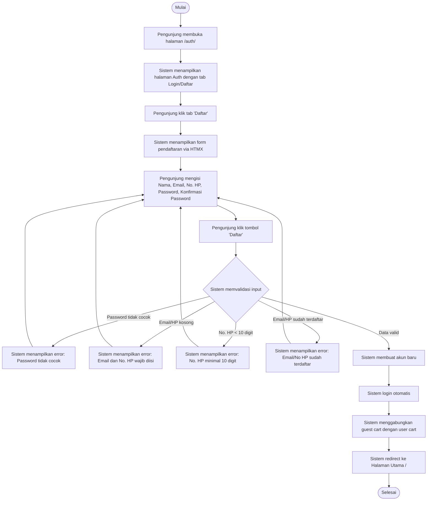

---

## 2. Login Akun

**Aktor:** Customer (Member Terdaftar)  
**Swimlane:** Customer | Sistem

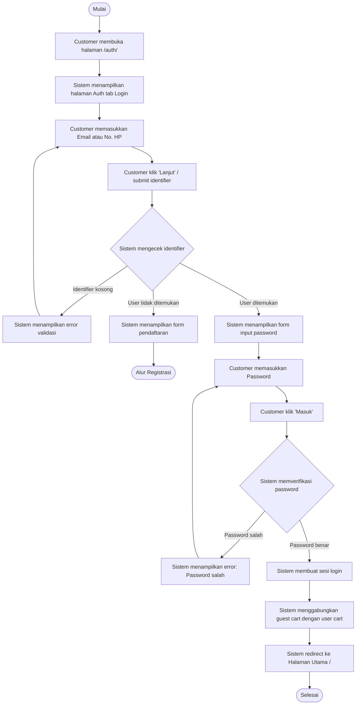

---

## 3. Login dengan Google OAuth

**Aktor:** Customer  
**Swimlane:** Customer | Sistem | Google

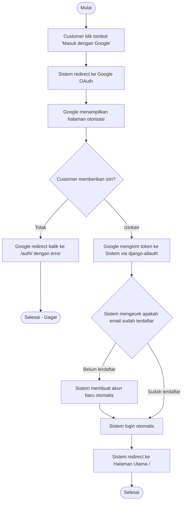

---

## 4. Lupa Password (OTP Email)

**Aktor:** Customer  
**Swimlane:** Customer | Sistem | Email

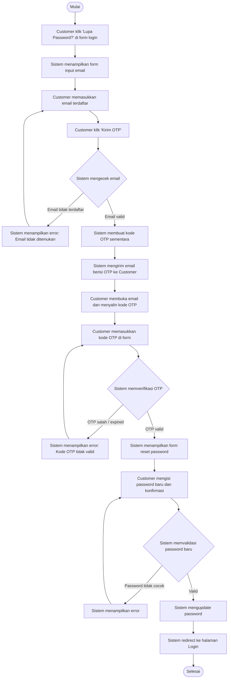

---

## 5. Melihat Katalog & Filter Produk

**Aktor:** Pengunjung / Customer  
**Swimlane:** Pengunjung | Sistem

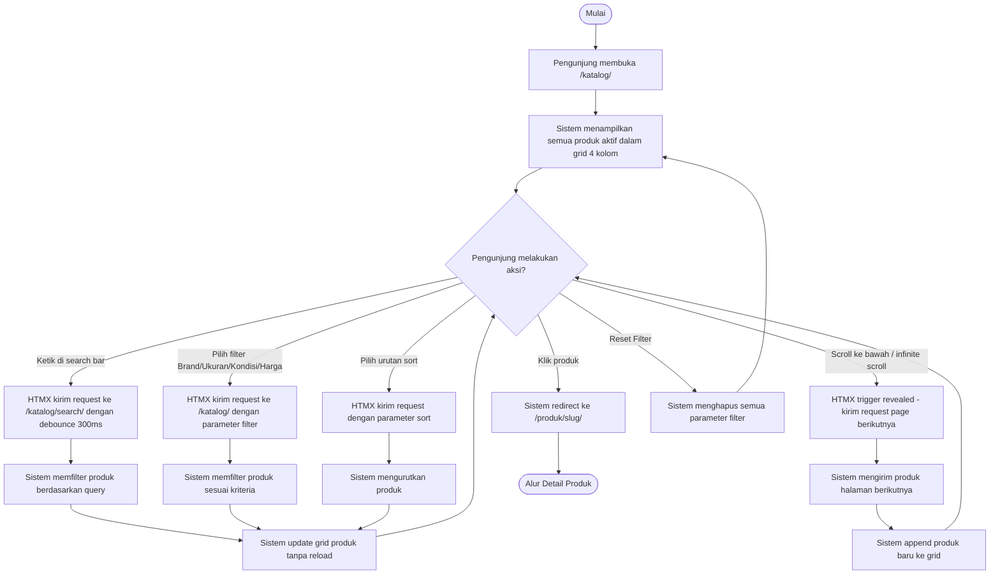

---

## 6. Melihat Detail Produk

**Aktor:** Pengunjung / Customer  
**Swimlane:** Pengunjung | Sistem

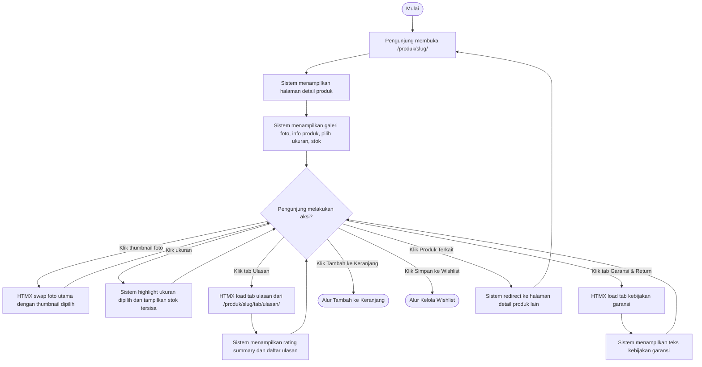

---

## 7. Tambah ke Keranjang

**Aktor:** Pengunjung / Customer  
**Swimlane:** Pengunjung | Sistem

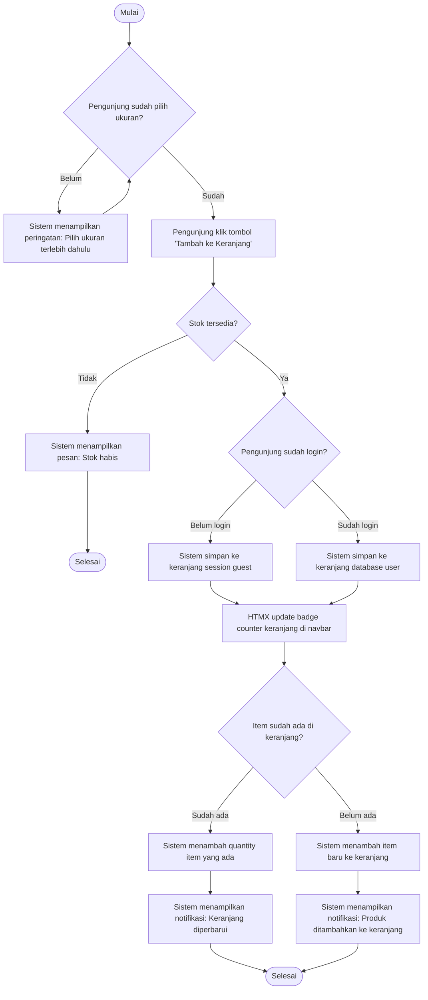

---

## 8. Kelola Wishlist

**Aktor:** Customer (harus login)  
**Swimlane:** Customer | Sistem

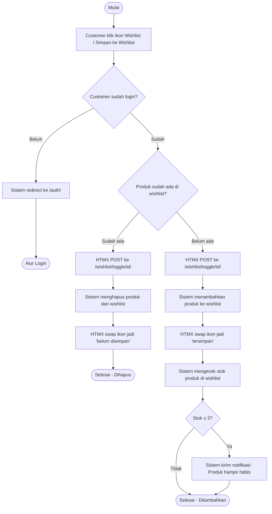

---

## 9. Checkout & Pembayaran (Midtrans)

**Aktor:** Customer  
**Swimlane:** Customer | Sistem | RajaOngkir | Midtrans

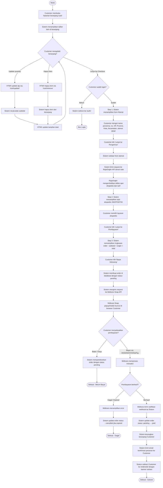

---

## 10. Tracking Status Pesanan

**Aktor:** Customer  
**Swimlane:** Customer | Sistem

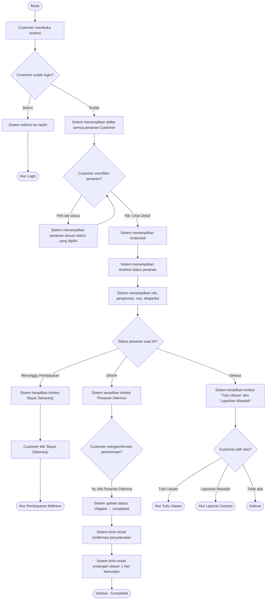

---

## 11. Tulis Ulasan Produk

**Aktor:** Customer  
**Swimlane:** Customer | Sistem

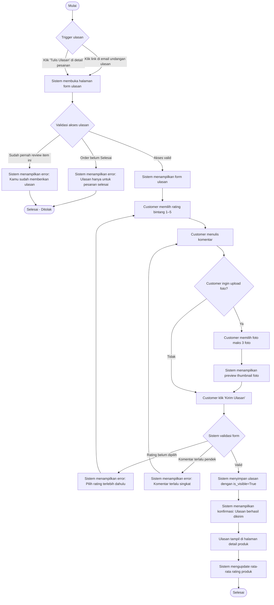

---

## 12. Laporan Garansi / Kendala Produk

**Aktor:** Customer  
**Swimlane:** Customer | Sistem | Admin/Jasmine

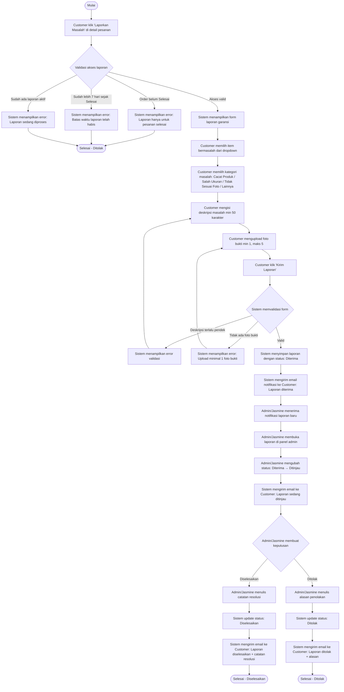

---

## 13. Admin Toko — Kelola Produk

**Aktor:** Admin Toko  
**Swimlane:** Admin Toko | Sistem

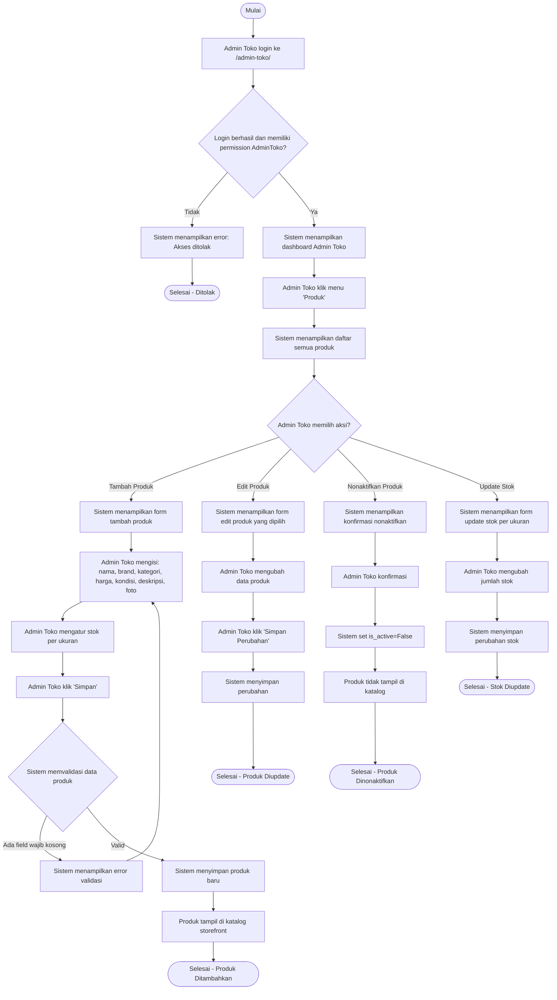

---

## 14. Admin Toko — Proses Pesanan & Input Resi

**Aktor:** Admin Toko  
**Swimlane:** Admin Toko | Sistem | Customer

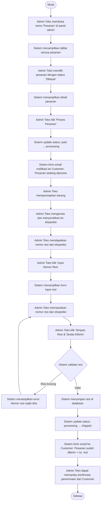

---

## 15. Admin Toko — Moderasi Ulasan

**Aktor:** Admin Toko  
**Swimlane:** Admin Toko | Sistem

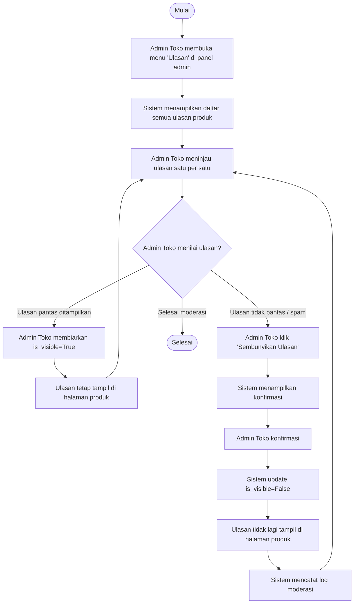

---

## 16. Admin Toko — Tinjau Laporan Garansi

**Aktor:** Admin Toko  
**Swimlane:** Admin Toko | Sistem | Customer

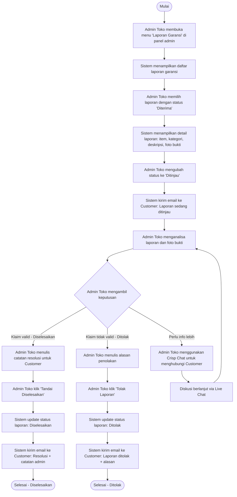

---

## 17. Jasmine (Owner) — Kelola Produk Lengkap

**Aktor:** Jasmine (Owner)  
**Swimlane:** Jasmine | Sistem

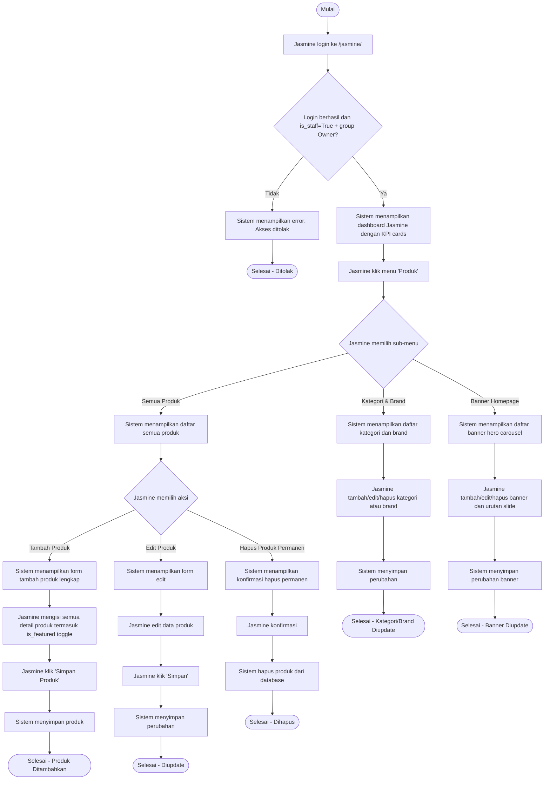

---

## 18. Jasmine (Owner) — Export Laporan Penjualan

**Aktor:** Jasmine (Owner)  
**Swimlane:** Jasmine | Sistem

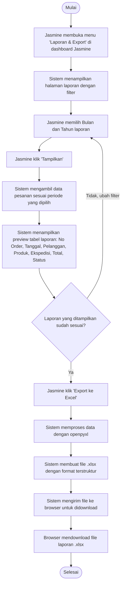

---

## 19. Jasmine (Owner) — Kelola Admin Toko

**Aktor:** Jasmine (Owner)  
**Swimlane:** Jasmine | Sistem

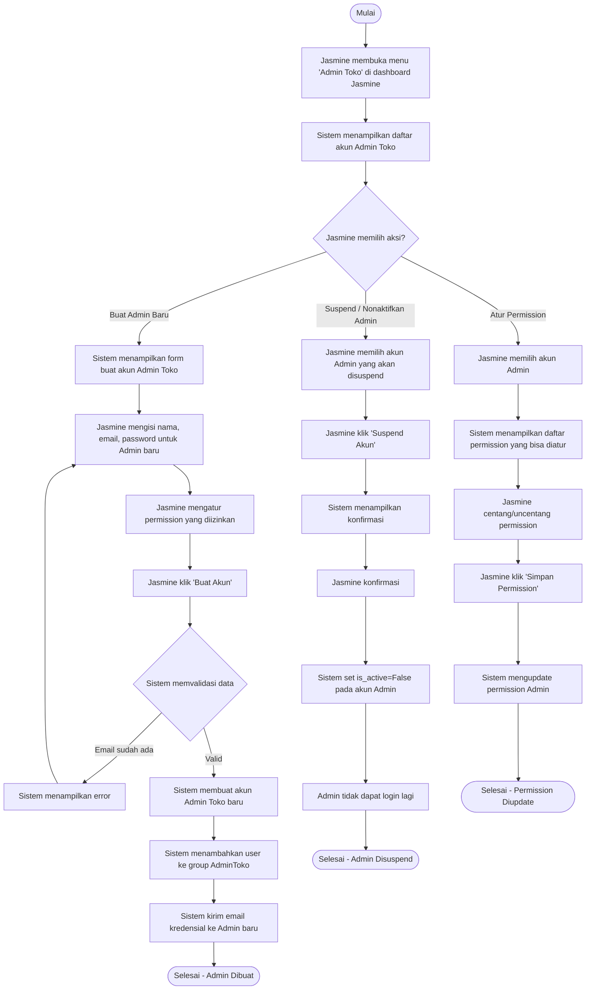

---

## 20. Notifikasi Email Otomatis

**Aktor:** Sistem (Background Job via django-apscheduler)  
**Swimlane:** Sistem | Email Server | Customer

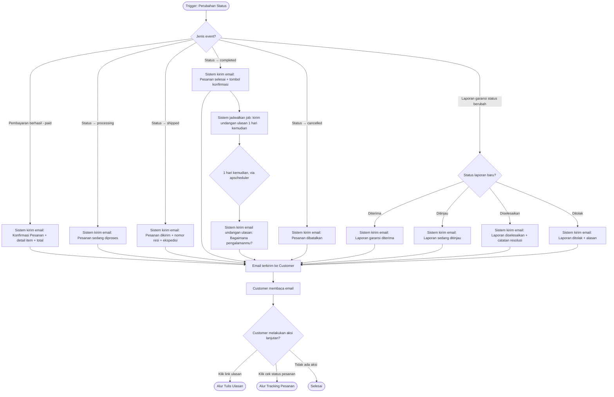

---

## Ringkasan Aktor & Proses

| No | Proses | Aktor Utama | Modul |
|---|---|---|---|
| 1 | Registrasi Akun | Pengunjung | userauths |
| 2 | Login Akun | Customer | userauths |
| 3 | Login Google OAuth | Customer | userauths / allauth |
| 4 | Lupa Password | Customer | userauths |
| 5 | Katalog & Filter Produk | Pengunjung / Customer | storefront / products |
| 6 | Detail Produk | Pengunjung / Customer | storefront / products |
| 7 | Tambah ke Keranjang | Pengunjung / Customer | orders (cart) |
| 8 | Kelola Wishlist | Customer | storefront |
| 9 | Checkout & Pembayaran | Customer | orders / Midtrans |
| 10 | Tracking Status Pesanan | Customer | orders |
| 11 | Tulis Ulasan Produk | Customer | aftersales |
| 12 | Laporan Garansi | Customer | aftersales |
| 13 | Kelola Produk | Admin Toko | admintoko / products |
| 14 | Proses Pesanan & Resi | Admin Toko | admintoko / orders |
| 15 | Moderasi Ulasan | Admin Toko | admintoko / aftersales |
| 16 | Tinjau Laporan Garansi | Admin Toko | admintoko / aftersales |
| 17 | Kelola Produk Lengkap | Jasmine (Owner) | jasmine / products |
| 18 | Export Laporan Penjualan | Jasmine (Owner) | jasmine / reports |
| 19 | Kelola Admin Toko | Jasmine (Owner) | jasmine / userauths |
| 20 | Notifikasi Email Otomatis | Sistem | core / signals |
