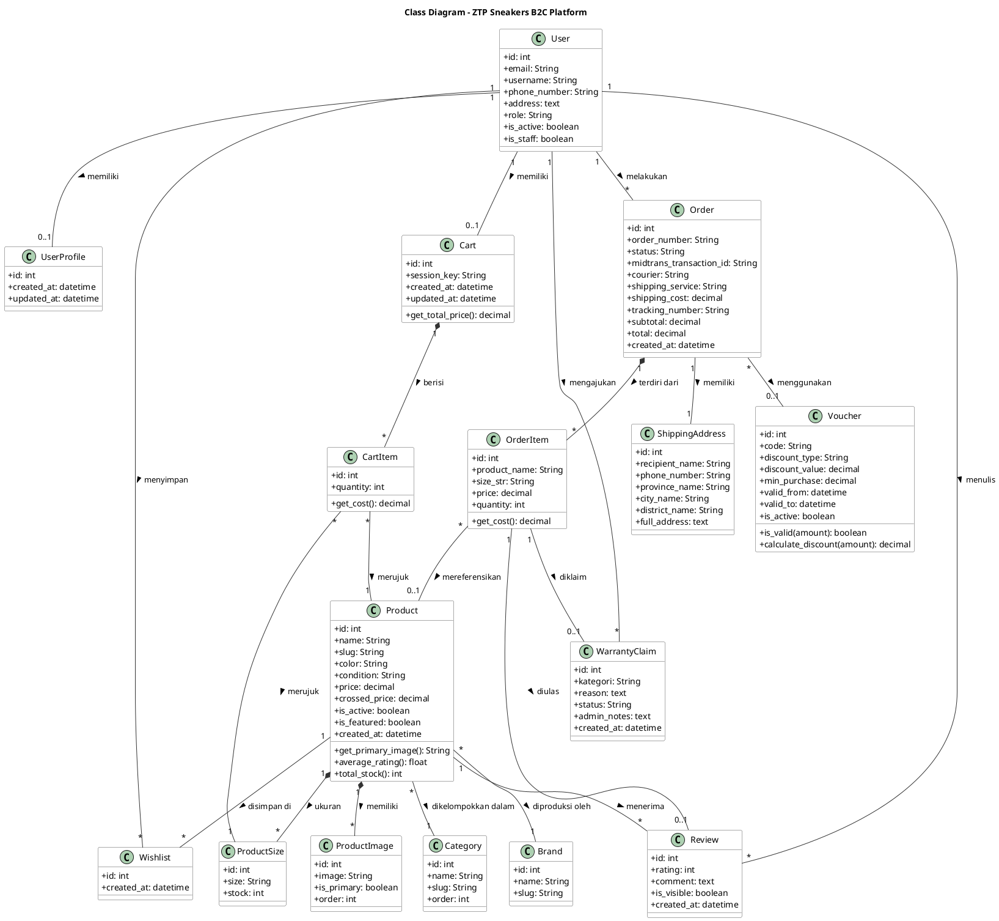

# Class Diagram — ZTP Sneakers B2C Platform

> **Versi:** 1.0  
> **Tanggal:** 2026  
> **Author:** Wahyu Ahmad Cahyadi (221103805)  
> **Tool:** PlantUML  

> **Cara Render:** Copy kode di bawah ini lalu paste di [PlantUML Online](https://www.plantuml.com/plantuml/uml/) atau gunakan ekstensi PlantUML di VSCode.

---

