# Sequence Diagram — ZTP Sneakers B2C Platform

> **Versi:** 1.0  
> **Tanggal:** 2026  
> **Author:** Wahyu Ahmad Cahyadi (221103805)  
> **Tool:** Mermaid  

> **Cara Render:** Gunakan [Mermaid Live Editor](https://mermaid.live/) atau ekstensi Mermaid di VSCode.

---

## Daftar Sequence Diagram

1. [Registrasi Akun](#1-registrasi-akun)
2. [Login Akun](#2-login-akun)
3. [Login dengan Google OAuth](#3-login-dengan-google-oauth)
4. [Lupa Password](#4-lupa-password)
5. [Melihat Katalog & Filter Produk](#5-melihat-katalog--filter-produk)
6. [Melihat Detail Produk](#6-melihat-detail-produk)
7. [Tambah ke Keranjang](#7-tambah-ke-keranjang)
8. [Kelola Wishlist](#8-kelola-wishlist)
9. [Checkout & Pembayaran](#9-checkout--pembayaran)
10. [Tracking Status Pesanan](#10-tracking-status-pesanan)
11. [Konfirmasi Penerimaan Pesanan](#11-konfirmasi-penerimaan-pesanan)
12. [Tulis Ulasan Produk](#12-tulis-ulasan-produk)
13. [Laporan Garansi / Kendala Produk](#13-laporan-garansi--kendala-produk)
14. [Admin Toko — Kelola Produk & Stok](#14-admin-toko--kelola-produk--stok)
15. [Admin Toko — Proses Pesanan & Input Resi](#15-admin-toko--proses-pesanan--input-resi)
16. [Admin Toko — Moderasi Ulasan](#16-admin-toko--moderasi-ulasan)
17. [Admin Toko — Tinjau Laporan Garansi](#17-admin-toko--tinjau-laporan-garansi)
18. [Jasmine — Kelola Produk Lengkap](#18-jasmine--kelola-produk-lengkap)
19. [Jasmine — Export Laporan Penjualan](#19-jasmine--export-laporan-penjualan)
20. [Jasmine — Kelola Akun Admin Toko](#20-jasmine--kelola-akun-admin-toko)

---

## 1. Registrasi Akun

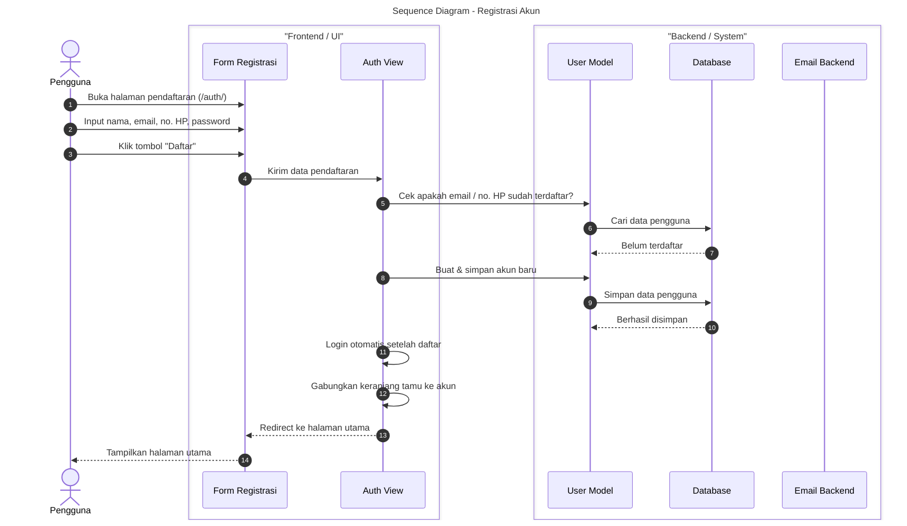
```mermaid
sequenceDiagram
    title Sequence Diagram - Registrasi Akun

    autonumber
    actor U as Pengguna
    box "Frontend / UI"
    participant F as Form Registrasi
    participant A as Auth View
    end
    box "Backend / System"
    participant M as User Model
    participant DB as Database
    participant E as Email Backend
    end

    U->>F: Buka halaman pendaftaran (/auth/)
    U->>F: Input nama, email, no. HP, password
    U->>F: Klik tombol "Daftar"
    F->>A: Kirim data pendaftaran

    A->>M: Cek apakah email / no. HP sudah terdaftar?
    M->>DB: Cari data pengguna
    DB-->>M: Belum terdaftar

    A->>M: Buat & simpan akun baru
    M->>DB: Simpan data pengguna
    DB-->>M: Berhasil disimpan

    A->>A: Login otomatis setelah daftar
    A->>A: Gabungkan keranjang tamu ke akun

    A-->>F: Redirect ke halaman utama
    F-->>U: Tampilkan halaman utama
```

---

## 2. Login Akun

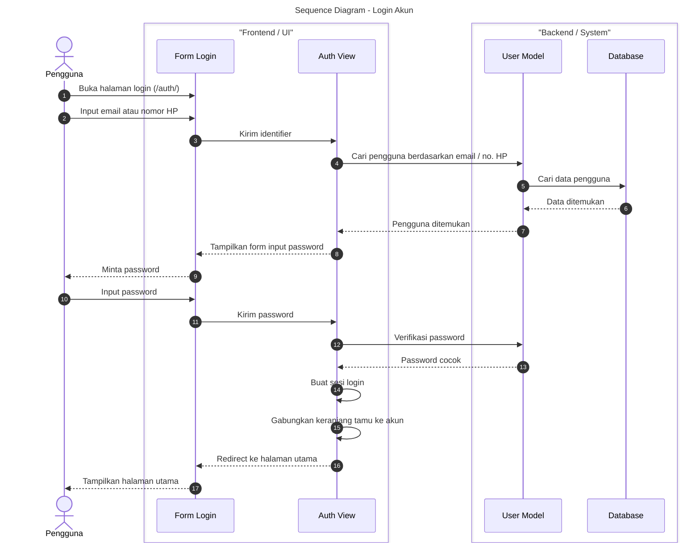
```mermaid
sequenceDiagram
    title Sequence Diagram - Login Akun

    autonumber
    actor U as Pengguna
    box "Frontend / UI"
    participant F as Form Login
    participant A as Auth View
    end
    box "Backend / System"
    participant M as User Model
    participant DB as Database
    end

    U->>F: Buka halaman login (/auth/)
    U->>F: Input email atau nomor HP
    F->>A: Kirim identifier

    A->>M: Cari pengguna berdasarkan email / no. HP
    M->>DB: Cari data pengguna
    DB-->>M: Data ditemukan
    M-->>A: Pengguna ditemukan

    A-->>F: Tampilkan form input password
    F-->>U: Minta password

    U->>F: Input password
    F->>A: Kirim password

    A->>M: Verifikasi password
    M-->>A: Password cocok

    A->>A: Buat sesi login
    A->>A: Gabungkan keranjang tamu ke akun
    A-->>F: Redirect ke halaman utama
    F-->>U: Tampilkan halaman utama
```

---

## 5. Melihat Katalog & Filter Produk

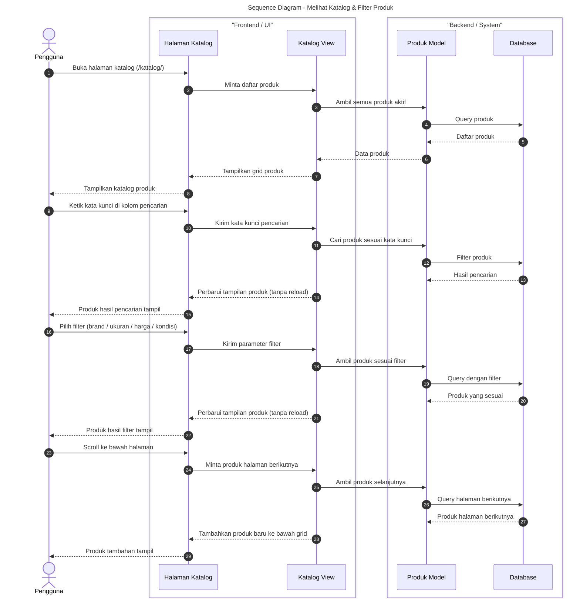
```mermaid
sequenceDiagram
    title Sequence Diagram - Melihat Katalog & Filter Produk

    autonumber
    actor U as Pengguna
    box "Frontend / UI"
    participant K as Halaman Katalog
    participant V as Katalog View
    end
    box "Backend / System"
    participant M as Produk Model
    participant DB as Database
    end

    U->>K: Buka halaman katalog (/katalog/)
    K->>V: Minta daftar produk
    V->>M: Ambil semua produk aktif
    M->>DB: Query produk
    DB-->>M: Daftar produk
    M-->>V: Data produk
    V-->>K: Tampilkan grid produk
    K-->>U: Tampilkan katalog produk

    U->>K: Ketik kata kunci di kolom pencarian
    K->>V: Kirim kata kunci pencarian
    V->>M: Cari produk sesuai kata kunci
    M->>DB: Filter produk
    DB-->>M: Hasil pencarian
    V-->>K: Perbarui tampilan produk (tanpa reload)
    K-->>U: Produk hasil pencarian tampil

    U->>K: Pilih filter (brand / ukuran / harga / kondisi)
    K->>V: Kirim parameter filter
    V->>M: Ambil produk sesuai filter
    M->>DB: Query dengan filter
    DB-->>M: Produk yang sesuai
    V-->>K: Perbarui tampilan produk (tanpa reload)
    K-->>U: Produk hasil filter tampil

    U->>K: Scroll ke bawah halaman
    K->>V: Minta produk halaman berikutnya
    V->>M: Ambil produk selanjutnya
    M->>DB: Query halaman berikutnya
    DB-->>M: Produk halaman berikutnya
    V-->>K: Tambahkan produk baru ke bawah grid
    K-->>U: Produk tambahan tampil
```

---

## 6. Melihat Detail Produk

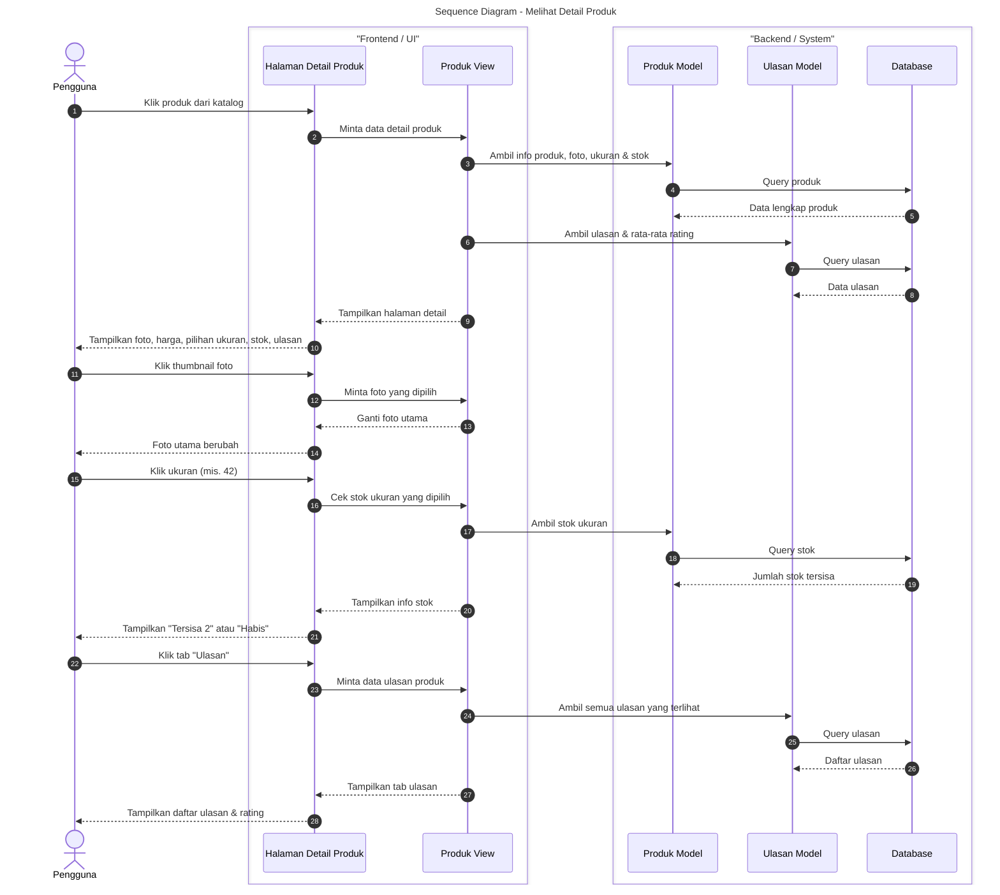
```mermaid
sequenceDiagram
    title Sequence Diagram - Melihat Detail Produk

    autonumber
    actor U as Pengguna
    box "Frontend / UI"
    participant H as Halaman Detail Produk
    participant V as Produk View
    end
    box "Backend / System"
    participant M as Produk Model
    participant UM as Ulasan Model
    participant DB as Database
    end

    U->>H: Klik produk dari katalog
    H->>V: Minta data detail produk
    V->>M: Ambil info produk, foto, ukuran & stok
    M->>DB: Query produk
    DB-->>M: Data lengkap produk
    V->>UM: Ambil ulasan & rata-rata rating
    UM->>DB: Query ulasan
    DB-->>UM: Data ulasan
    V-->>H: Tampilkan halaman detail
    H-->>U: Tampilkan foto, harga, pilihan ukuran, stok, ulasan

    U->>H: Klik thumbnail foto
    H->>V: Minta foto yang dipilih
    V-->>H: Ganti foto utama
    H-->>U: Foto utama berubah

    U->>H: Klik ukuran (mis. 42)
    H->>V: Cek stok ukuran yang dipilih
    V->>M: Ambil stok ukuran
    M->>DB: Query stok
    DB-->>M: Jumlah stok tersisa
    V-->>H: Tampilkan info stok
    H-->>U: Tampilkan "Tersisa 2" atau "Habis"

    U->>H: Klik tab "Ulasan"
    H->>V: Minta data ulasan produk
    V->>UM: Ambil semua ulasan yang terlihat
    UM->>DB: Query ulasan
    DB-->>UM: Daftar ulasan
    V-->>H: Tampilkan tab ulasan
    H-->>U: Tampilkan daftar ulasan & rating
```

---

## 7. Tambah ke Keranjang

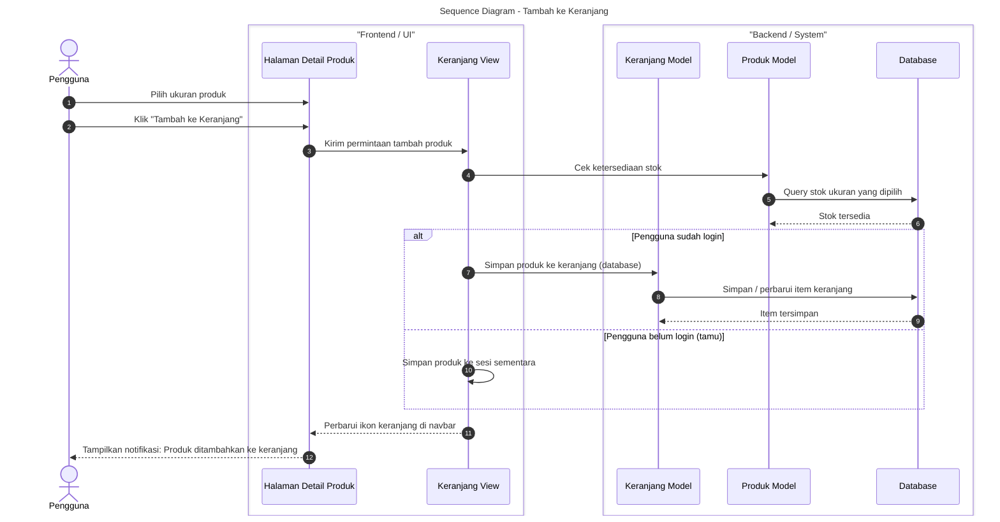
```mermaid
sequenceDiagram
    title Sequence Diagram - Tambah ke Keranjang

    autonumber
    actor U as Pengguna
    box "Frontend / UI"
    participant H as Halaman Detail Produk
    participant V as Keranjang View
    end
    box "Backend / System"
    participant K as Keranjang Model
    participant M as Produk Model
    participant DB as Database
    end

    U->>H: Pilih ukuran produk
    U->>H: Klik "Tambah ke Keranjang"
    H->>V: Kirim permintaan tambah produk

    V->>M: Cek ketersediaan stok
    M->>DB: Query stok ukuran yang dipilih
    DB-->>M: Stok tersedia

    alt Pengguna sudah login
        V->>K: Simpan produk ke keranjang (database)
        K->>DB: Simpan / perbarui item keranjang
        DB-->>K: Item tersimpan
    else Pengguna belum login (tamu)
        V->>V: Simpan produk ke sesi sementara
    end

    V-->>H: Perbarui ikon keranjang di navbar
    H-->>U: Tampilkan notifikasi: Produk ditambahkan ke keranjang
```

---

## 8. Kelola Wishlist

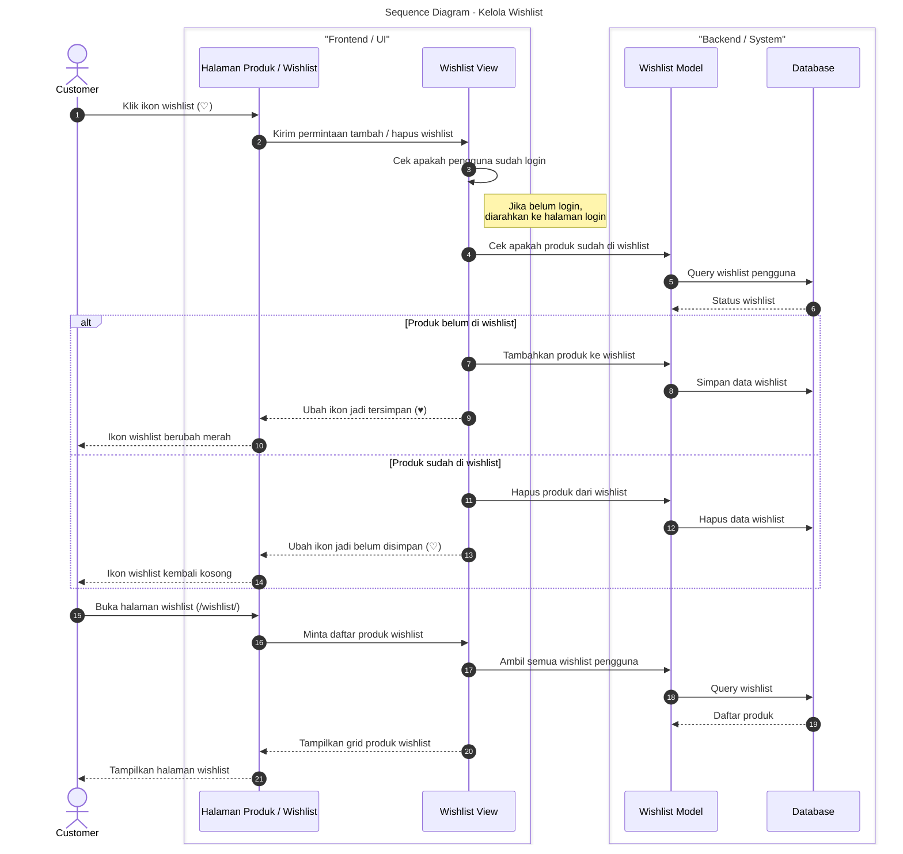
```mermaid
sequenceDiagram
    title Sequence Diagram - Kelola Wishlist

    autonumber
    actor U as Customer
    box "Frontend / UI"
    participant H as Halaman Produk / Wishlist
    participant V as Wishlist View
    end
    box "Backend / System"
    participant W as Wishlist Model
    participant DB as Database
    end

    U->>H: Klik ikon wishlist (♡)
    H->>V: Kirim permintaan tambah / hapus wishlist

    V->>V: Cek apakah pengguna sudah login
    Note right of V: Jika belum login,<br/>diarahkan ke halaman login

    V->>W: Cek apakah produk sudah di wishlist
    W->>DB: Query wishlist pengguna
    DB-->>W: Status wishlist

    alt Produk belum di wishlist
        V->>W: Tambahkan produk ke wishlist
        W->>DB: Simpan data wishlist
        V-->>H: Ubah ikon jadi tersimpan (♥)
        H-->>U: Ikon wishlist berubah merah
    else Produk sudah di wishlist
        V->>W: Hapus produk dari wishlist
        W->>DB: Hapus data wishlist
        V-->>H: Ubah ikon jadi belum disimpan (♡)
        H-->>U: Ikon wishlist kembali kosong
    end

    U->>H: Buka halaman wishlist (/wishlist/)
    H->>V: Minta daftar produk wishlist
    V->>W: Ambil semua wishlist pengguna
    W->>DB: Query wishlist
    DB-->>W: Daftar produk
    V-->>H: Tampilkan grid produk wishlist
    H-->>U: Tampilkan halaman wishlist
```

---

## 9. Checkout & Pembayaran

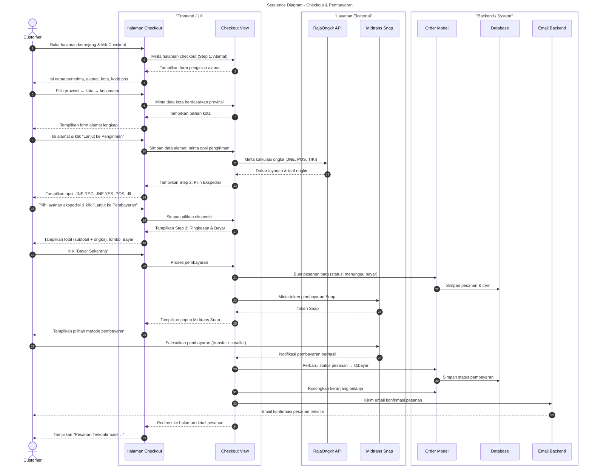
```mermaid
sequenceDiagram
    title Sequence Diagram - Checkout & Pembayaran

    autonumber
    actor U as Customer
    box "Frontend / UI"
    participant H as Halaman Checkout
    participant V as Checkout View
    end
    box "Layanan Eksternal"
    participant R as RajaOngkir API
    participant M as Midtrans Snap
    end
    box "Backend / System"
    participant O as Order Model
    participant DB as Database
    participant E as Email Backend
    end

    U->>H: Buka halaman keranjang & klik Checkout
    H->>V: Minta halaman checkout (Step 1: Alamat)
    V-->>H: Tampilkan form pengisian alamat
    H-->>U: Isi nama penerima, alamat, kota, kode pos

    U->>H: Pilih provinsi → kota → kecamatan
    H->>V: Minta data kota berdasarkan provinsi
    V-->>H: Tampilkan pilihan kota
    H-->>U: Tampilkan form alamat lengkap

    U->>H: Isi alamat & klik "Lanjut ke Pengiriman"
    H->>V: Simpan data alamat, minta opsi pengiriman
    V->>R: Minta kalkulasi ongkir (JNE, POS, TIKI)
    R-->>V: Daftar layanan & tarif ongkir
    V-->>H: Tampilkan Step 2: Pilih Ekspedisi
    H-->>U: Tampilkan opsi: JNE REG, JNE YES, POS, dll.

    U->>H: Pilih layanan ekspedisi & klik "Lanjut ke Pembayaran"
    H->>V: Simpan pilihan ekspedisi
    V-->>H: Tampilkan Step 3: Ringkasan & Bayar
    H-->>U: Tampilkan total (subtotal + ongkir), tombol Bayar

    U->>H: Klik "Bayar Sekarang"
    H->>V: Proses pembayaran
    V->>O: Buat pesanan baru (status: menunggu bayar)
    O->>DB: Simpan pesanan & item
    V->>M: Minta token pembayaran Snap
    M-->>V: Token Snap
    V-->>H: Tampilkan popup Midtrans Snap
    H-->>U: Tampilkan pilihan metode pembayaran

    U->>M: Selesaikan pembayaran (transfer / e-wallet)
    M-->>V: Notifikasi pembayaran berhasil
    V->>O: Perbarui status pesanan → Dibayar
    O->>DB: Simpan status pembayaran
    V->>O: Kosongkan keranjang belanja
    V->>E: Kirim email konfirmasi pesanan
    E-->>U: Email konfirmasi pesanan terkirim
    V-->>H: Redirect ke halaman detail pesanan
    H-->>U: Tampilkan "Pesanan Terkonfirmasi! 🎉"
```

---

## 10. Tracking Status Pesanan

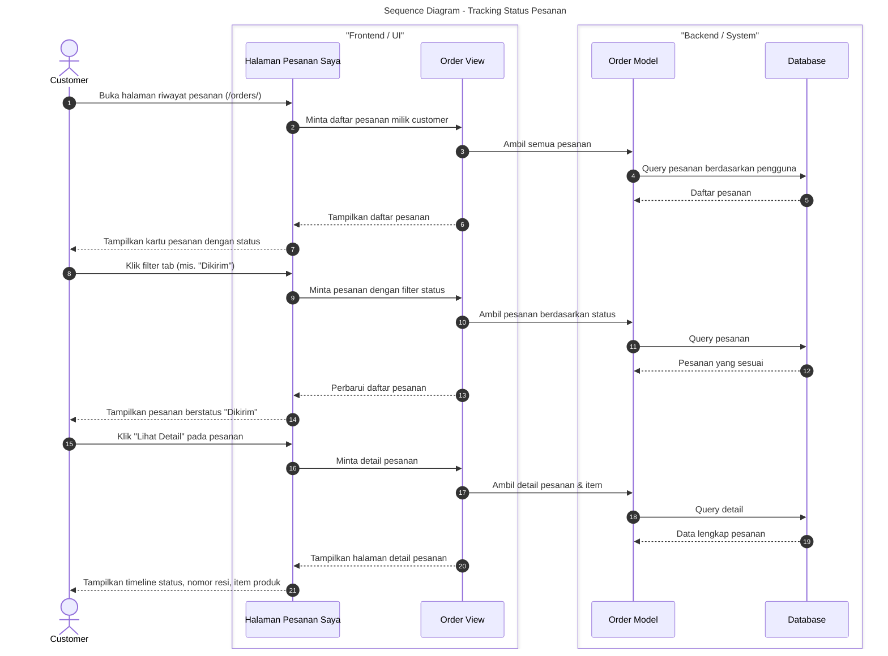
```mermaid
sequenceDiagram
    title Sequence Diagram - Tracking Status Pesanan

    autonumber
    actor U as Customer
    box "Frontend / UI"
    participant H as Halaman Pesanan Saya
    participant V as Order View
    end
    box "Backend / System"
    participant O as Order Model
    participant DB as Database
    end

    U->>H: Buka halaman riwayat pesanan (/orders/)
    H->>V: Minta daftar pesanan milik customer
    V->>O: Ambil semua pesanan
    O->>DB: Query pesanan berdasarkan pengguna
    DB-->>O: Daftar pesanan
    V-->>H: Tampilkan daftar pesanan
    H-->>U: Tampilkan kartu pesanan dengan status

    U->>H: Klik filter tab (mis. "Dikirim")
    H->>V: Minta pesanan dengan filter status
    V->>O: Ambil pesanan berdasarkan status
    O->>DB: Query pesanan
    DB-->>O: Pesanan yang sesuai
    V-->>H: Perbarui daftar pesanan
    H-->>U: Tampilkan pesanan berstatus "Dikirim"

    U->>H: Klik "Lihat Detail" pada pesanan
    H->>V: Minta detail pesanan
    V->>O: Ambil detail pesanan & item
    O->>DB: Query detail
    DB-->>O: Data lengkap pesanan
    V-->>H: Tampilkan halaman detail pesanan
    H-->>U: Tampilkan timeline status, nomor resi, item produk
```

---

## 11. Konfirmasi Penerimaan Pesanan

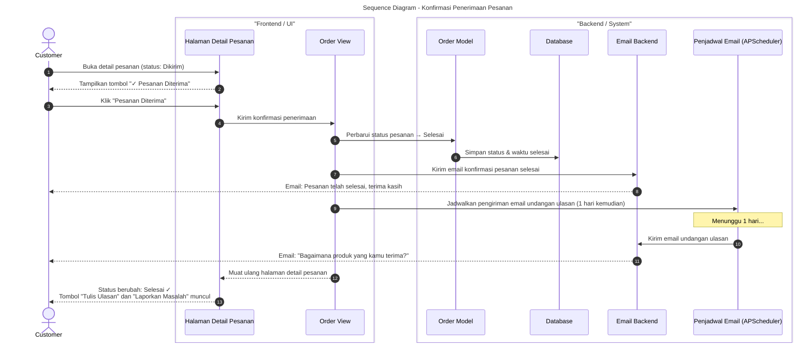
```mermaid
sequenceDiagram
    title Sequence Diagram - Konfirmasi Penerimaan Pesanan

    autonumber
    actor U as Customer
    box "Frontend / UI"
    participant H as Halaman Detail Pesanan
    participant V as Order View
    end
    box "Backend / System"
    participant O as Order Model
    participant DB as Database
    participant E as Email Backend
    participant S as Penjadwal Email (APScheduler)
    end

    U->>H: Buka detail pesanan (status: Dikirim)
    H-->>U: Tampilkan tombol "✓ Pesanan Diterima"

    U->>H: Klik "Pesanan Diterima"
    H->>V: Kirim konfirmasi penerimaan
    V->>O: Perbarui status pesanan → Selesai
    O->>DB: Simpan status & waktu selesai

    V->>E: Kirim email konfirmasi pesanan selesai
    E-->>U: Email: Pesanan telah selesai, terima kasih

    V->>S: Jadwalkan pengiriman email undangan ulasan (1 hari kemudian)

    Note over S: Menunggu 1 hari...

    S->>E: Kirim email undangan ulasan
    E-->>U: Email: "Bagaimana produk yang kamu terima?"

    V-->>H: Muat ulang halaman detail pesanan
    H-->>U: Status berubah: Selesai ✓<br/>Tombol "Tulis Ulasan" dan "Laporkan Masalah" muncul
```

---

## 12. Tulis Ulasan Produk

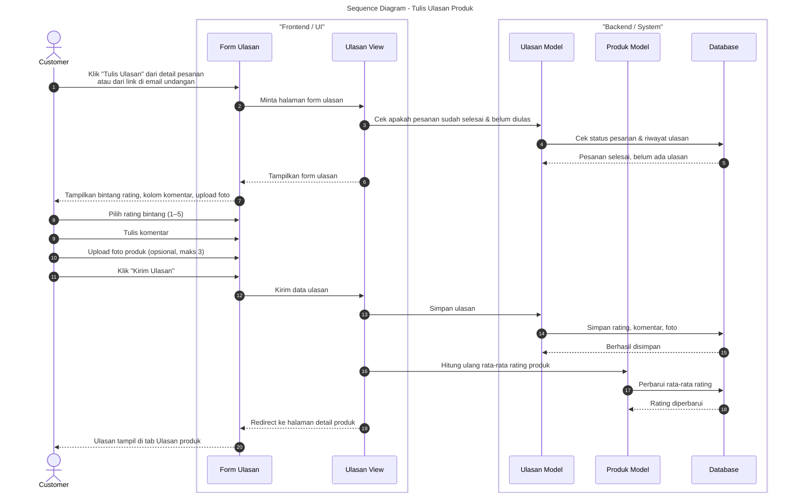
```mermaid
sequenceDiagram
    title Sequence Diagram - Tulis Ulasan Produk

    autonumber
    actor U as Customer
    box "Frontend / UI"
    participant F as Form Ulasan
    participant V as Ulasan View
    end
    box "Backend / System"
    participant M as Ulasan Model
    participant P as Produk Model
    participant DB as Database
    end

    U->>F: Klik "Tulis Ulasan" dari detail pesanan<br/>atau dari link di email undangan
    F->>V: Minta halaman form ulasan
    V->>M: Cek apakah pesanan sudah selesai & belum diulas
    M->>DB: Cek status pesanan & riwayat ulasan
    DB-->>M: Pesanan selesai, belum ada ulasan
    V-->>F: Tampilkan form ulasan
    F-->>U: Tampilkan bintang rating, kolom komentar, upload foto

    U->>F: Pilih rating bintang (1–5)
    U->>F: Tulis komentar
    U->>F: Upload foto produk (opsional, maks 3)
    U->>F: Klik "Kirim Ulasan"
    F->>V: Kirim data ulasan

    V->>M: Simpan ulasan
    M->>DB: Simpan rating, komentar, foto
    DB-->>M: Berhasil disimpan

    V->>P: Hitung ulang rata-rata rating produk
    P->>DB: Perbarui rata-rata rating
    DB-->>P: Rating diperbarui

    V-->>F: Redirect ke halaman detail produk
    F-->>U: Ulasan tampil di tab Ulasan produk
```

---

## 13. Laporan Garansi / Kendala Produk

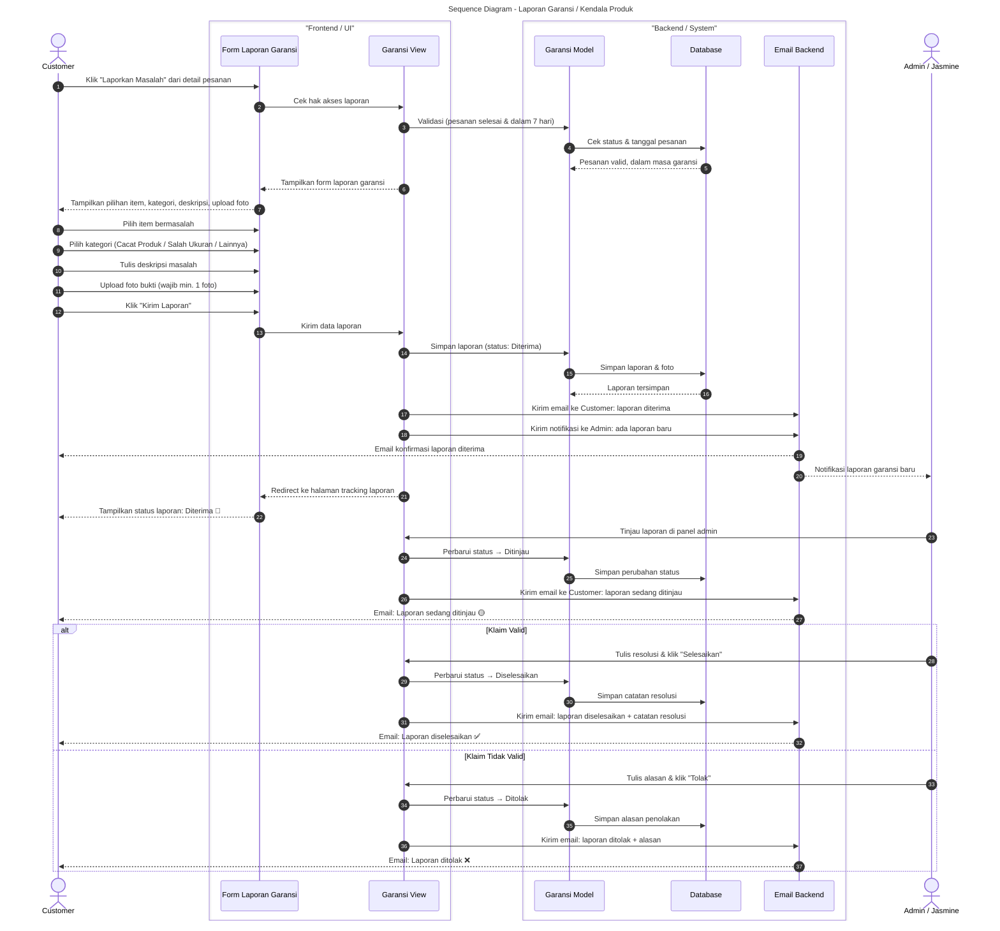
```mermaid
sequenceDiagram
    title Sequence Diagram - Laporan Garansi / Kendala Produk

    autonumber
    actor U as Customer
    box "Frontend / UI"
    participant F as Form Laporan Garansi
    participant V as Garansi View
    end
    box "Backend / System"
    participant G as Garansi Model
    participant DB as Database
    participant E as Email Backend
    end
    actor A as Admin / Jasmine

    U->>F: Klik "Laporkan Masalah" dari detail pesanan
    F->>V: Cek hak akses laporan
    V->>G: Validasi (pesanan selesai & dalam 7 hari)
    G->>DB: Cek status & tanggal pesanan
    DB-->>G: Pesanan valid, dalam masa garansi
    V-->>F: Tampilkan form laporan garansi
    F-->>U: Tampilkan pilihan item, kategori, deskripsi, upload foto

    U->>F: Pilih item bermasalah
    U->>F: Pilih kategori (Cacat Produk / Salah Ukuran / Lainnya)
    U->>F: Tulis deskripsi masalah
    U->>F: Upload foto bukti (wajib min. 1 foto)
    U->>F: Klik "Kirim Laporan"
    F->>V: Kirim data laporan

    V->>G: Simpan laporan (status: Diterima)
    G->>DB: Simpan laporan & foto
    DB-->>G: Laporan tersimpan

    V->>E: Kirim email ke Customer: laporan diterima
    V->>E: Kirim notifikasi ke Admin: ada laporan baru
    E-->>U: Email konfirmasi laporan diterima
    E-->>A: Notifikasi laporan garansi baru

    V-->>F: Redirect ke halaman tracking laporan
    F-->>U: Tampilkan status laporan: Diterima 🔵

    A->>V: Tinjau laporan di panel admin
    V->>G: Perbarui status → Ditinjau
    G->>DB: Simpan perubahan status
    V->>E: Kirim email ke Customer: laporan sedang ditinjau
    E-->>U: Email: Laporan sedang ditinjau 🟡

    alt Klaim Valid
        A->>V: Tulis resolusi & klik "Selesaikan"
        V->>G: Perbarui status → Diselesaikan
        G->>DB: Simpan catatan resolusi
        V->>E: Kirim email: laporan diselesaikan + catatan resolusi
        E-->>U: Email: Laporan diselesaikan ✅
    else Klaim Tidak Valid
        A->>V: Tulis alasan & klik "Tolak"
        V->>G: Perbarui status → Ditolak
        G->>DB: Simpan alasan penolakan
        V->>E: Kirim email: laporan ditolak + alasan
        E-->>U: Email: Laporan ditolak ❌
    end
```

---

## 15. Admin Toko — Proses Pesanan & Input Resi

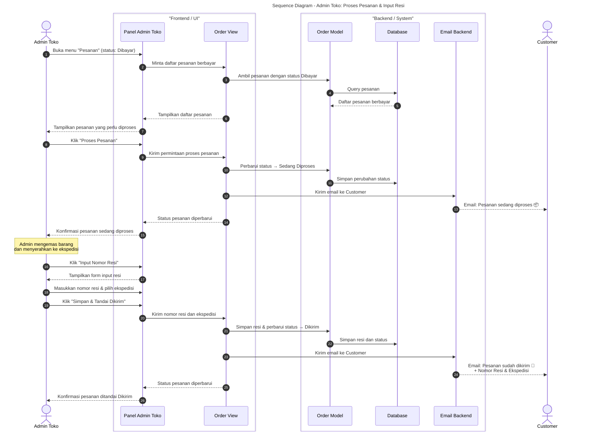
```mermaid
sequenceDiagram
    title Sequence Diagram - Admin Toko: Proses Pesanan & Input Resi

    autonumber
    actor A as Admin Toko
    box "Frontend / UI"
    participant P as Panel Admin Toko
    participant V as Order View
    end
    box "Backend / System"
    participant O as Order Model
    participant DB as Database
    participant E as Email Backend
    end
    actor U as Customer

    A->>P: Buka menu "Pesanan" (status: Dibayar)
    P->>V: Minta daftar pesanan berbayar
    V->>O: Ambil pesanan dengan status Dibayar
    O->>DB: Query pesanan
    DB-->>O: Daftar pesanan berbayar
    V-->>P: Tampilkan daftar pesanan
    P-->>A: Tampilkan pesanan yang perlu diproses

    A->>P: Klik "Proses Pesanan"
    P->>V: Kirim permintaan proses pesanan
    V->>O: Perbarui status → Sedang Diproses
    O->>DB: Simpan perubahan status
    V->>E: Kirim email ke Customer
    E-->>U: Email: Pesanan sedang diproses 📦
    V-->>P: Status pesanan diperbarui
    P-->>A: Konfirmasi pesanan sedang diproses

    Note over A: Admin mengemas barang<br/>dan menyerahkan ke ekspedisi

    A->>P: Klik "Input Nomor Resi"
    P-->>A: Tampilkan form input resi

    A->>P: Masukkan nomor resi & pilih ekspedisi
    A->>P: Klik "Simpan & Tandai Dikirim"
    P->>V: Kirim nomor resi dan ekspedisi
    V->>O: Simpan resi & perbarui status → Dikirim
    O->>DB: Simpan resi dan status
    V->>E: Kirim email ke Customer
    E-->>U: Email: Pesanan sudah dikirim 🚚<br/>+ Nomor Resi & Ekspedisi
    V-->>P: Status pesanan diperbarui
    P-->>A: Konfirmasi pesanan ditandai Dikirim
```

---

## 17. Admin Toko — Tinjau Laporan Garansi

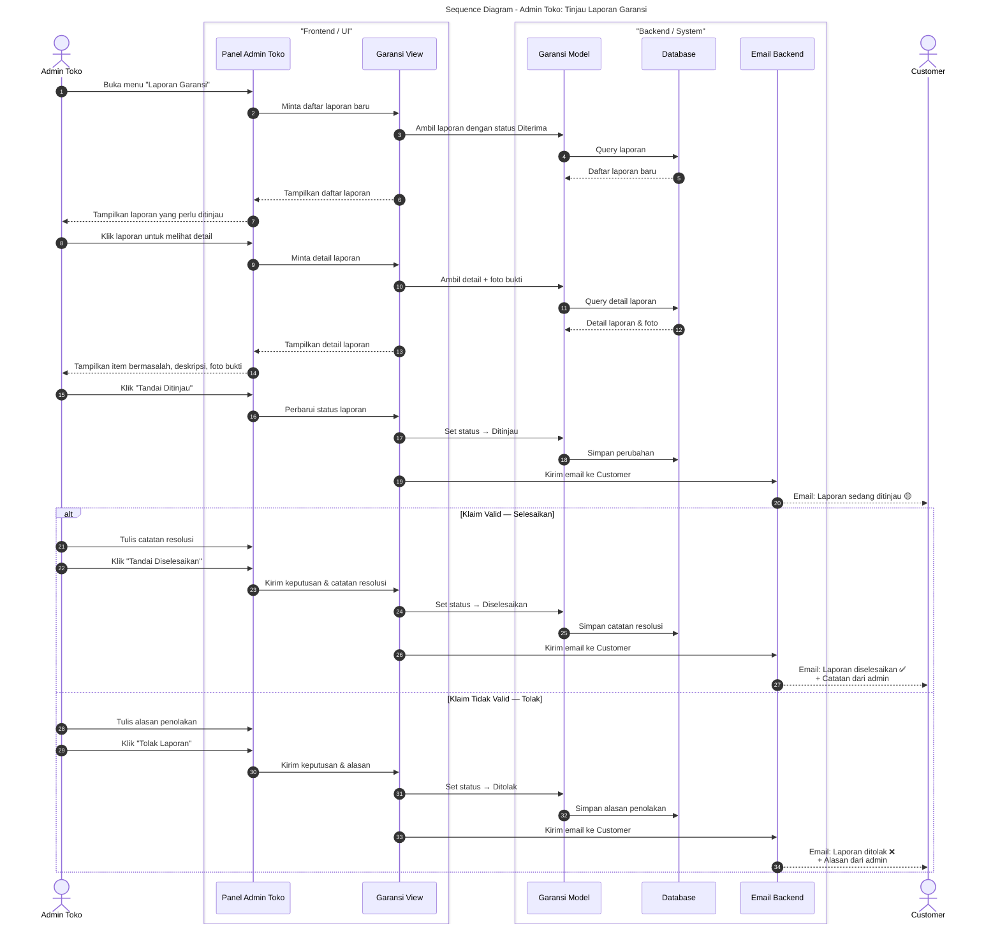
```mermaid
sequenceDiagram
    title Sequence Diagram - Admin Toko: Tinjau Laporan Garansi

    autonumber
    actor A as Admin Toko
    box "Frontend / UI"
    participant P as Panel Admin Toko
    participant V as Garansi View
    end
    box "Backend / System"
    participant G as Garansi Model
    participant DB as Database
    participant E as Email Backend
    end
    actor U as Customer

    A->>P: Buka menu "Laporan Garansi"
    P->>V: Minta daftar laporan baru
    V->>G: Ambil laporan dengan status Diterima
    G->>DB: Query laporan
    DB-->>G: Daftar laporan baru
    V-->>P: Tampilkan daftar laporan
    P-->>A: Tampilkan laporan yang perlu ditinjau

    A->>P: Klik laporan untuk melihat detail
    P->>V: Minta detail laporan
    V->>G: Ambil detail + foto bukti
    G->>DB: Query detail laporan
    DB-->>G: Detail laporan & foto
    V-->>P: Tampilkan detail laporan
    P-->>A: Tampilkan item bermasalah, deskripsi, foto bukti

    A->>P: Klik "Tandai Ditinjau"
    P->>V: Perbarui status laporan
    V->>G: Set status → Ditinjau
    G->>DB: Simpan perubahan
    V->>E: Kirim email ke Customer
    E-->>U: Email: Laporan sedang ditinjau 🟡

    alt Klaim Valid — Selesaikan
        A->>P: Tulis catatan resolusi
        A->>P: Klik "Tandai Diselesaikan"
        P->>V: Kirim keputusan & catatan resolusi
        V->>G: Set status → Diselesaikan
        G->>DB: Simpan catatan resolusi
        V->>E: Kirim email ke Customer
        E-->>U: Email: Laporan diselesaikan ✅<br/>+ Catatan dari admin
    else Klaim Tidak Valid — Tolak
        A->>P: Tulis alasan penolakan
        A->>P: Klik "Tolak Laporan"
        P->>V: Kirim keputusan & alasan
        V->>G: Set status → Ditolak
        G->>DB: Simpan alasan penolakan
        V->>E: Kirim email ke Customer
        E-->>U: Email: Laporan ditolak ❌<br/>+ Alasan dari admin
    end
```

---

## 19. Jasmine — Export Laporan Penjualan

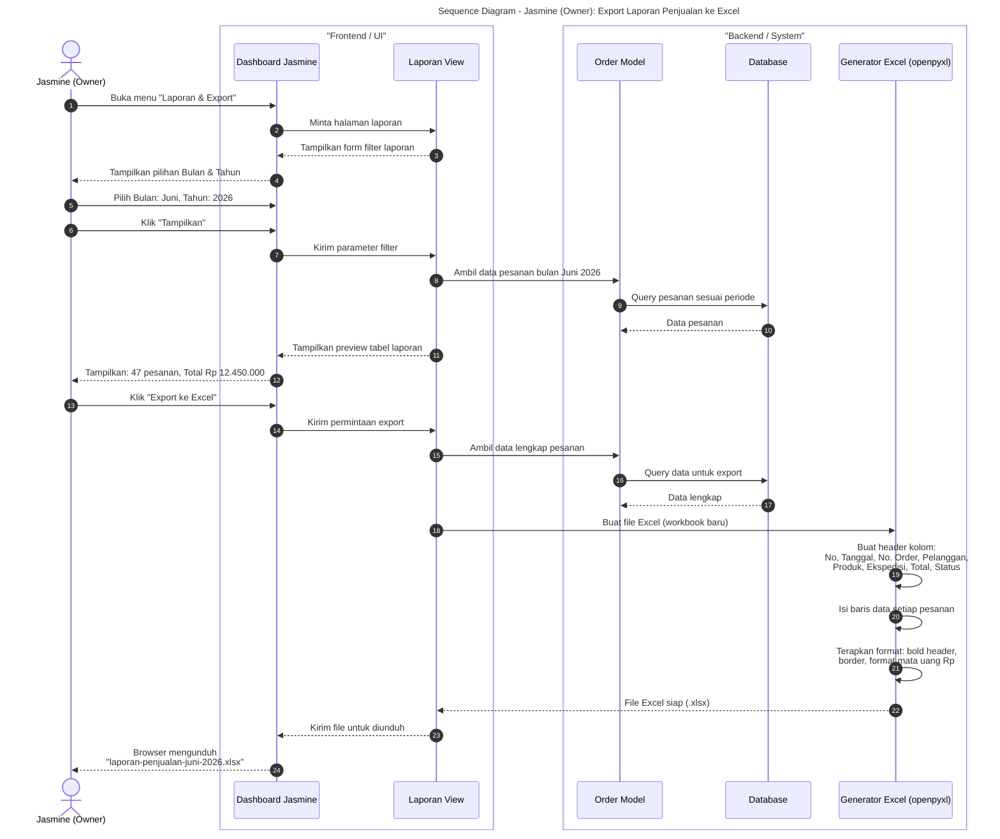
```mermaid
sequenceDiagram
    title Sequence Diagram - Jasmine (Owner): Export Laporan Penjualan ke Excel

    autonumber
    actor J as Jasmine (Owner)
    box "Frontend / UI"
    participant D as Dashboard Jasmine
    participant V as Laporan View
    end
    box "Backend / System"
    participant O as Order Model
    participant DB as Database
    participant X as Generator Excel (openpyxl)
    end

    J->>D: Buka menu "Laporan & Export"
    D->>V: Minta halaman laporan
    V-->>D: Tampilkan form filter laporan
    D-->>J: Tampilkan pilihan Bulan & Tahun

    J->>D: Pilih Bulan: Juni, Tahun: 2026
    J->>D: Klik "Tampilkan"
    D->>V: Kirim parameter filter
    V->>O: Ambil data pesanan bulan Juni 2026
    O->>DB: Query pesanan sesuai periode
    DB-->>O: Data pesanan
    V-->>D: Tampilkan preview tabel laporan
    D-->>J: Tampilkan: 47 pesanan, Total Rp 12.450.000

    J->>D: Klik "Export ke Excel"
    D->>V: Kirim permintaan export
    V->>O: Ambil data lengkap pesanan
    O->>DB: Query data untuk export
    DB-->>O: Data lengkap
    V->>X: Buat file Excel (workbook baru)
    X->>X: Buat header kolom:<br/>No, Tanggal, No. Order, Pelanggan,<br/>Produk, Ekspedisi, Total, Status
    X->>X: Isi baris data setiap pesanan
    X->>X: Terapkan format: bold header,<br/>border, format mata uang Rp
    X-->>V: File Excel siap (.xlsx)
    V-->>D: Kirim file untuk diunduh
    D-->>J: Browser mengunduh<br/>"laporan-penjualan-juni-2026.xlsx"
```