# Sequence Diagram — ZTP Sneakers B2C Platform

> **Versi:** 1.0  
> **Tanggal:** 2026  
> **Author:** Wahyu Ahmad Cahyadi (221103805)  
> **Tool:** PlantUML  

> **Cara Render:** Gunakan [PlantUML Online](https://www.plantuml.com/plantuml/uml/) atau ekstensi PlantUML di VSCode.

---

## Daftar Sequence Diagram

1. [Registrasi Akun](#1-registrasi-akun)
2. [Login Akun](#2-login-akun)
3. [Login dengan Google OAuth](#3-login-dengan-google-oauth)
4. [Lupa Password](#4-lupa-password)
5. [Melihat Katalog & Filter Produk](#5-melihat-katalog--filter-produk)
6. [Melihat Detail Produk](#6-melihat-detail-produk)
7. [Tambah ke Keranjang](#7-tambah-ke-keranjang)
8. [Kelola Wishlist](#8-kelola-wishlist)
9. [Checkout & Pembayaran](#9-checkout--pembayaran)
10. [Tracking Status Pesanan](#10-tracking-status-pesanan)
11. [Konfirmasi Penerimaan Pesanan](#11-konfirmasi-penerimaan-pesanan)
12. [Tulis Ulasan Produk](#12-tulis-ulasan-produk)
13. [Laporan Garansi / Kendala Produk](#13-laporan-garansi--kendala-produk)
14. [Admin Toko — Kelola Produk & Stok](#14-admin-toko--kelola-produk--stok)
15. [Admin Toko — Proses Pesanan & Input Resi](#15-admin-toko--proses-pesanan--input-resi)
16. [Admin Toko — Moderasi Ulasan](#16-admin-toko--moderasi-ulasan)
17. [Admin Toko — Tinjau Laporan Garansi](#17-admin-toko--tinjau-laporan-garansi)
18. [Jasmine — Kelola Produk Lengkap](#18-jasmine--kelola-produk-lengkap)
19. [Jasmine — Export Laporan Penjualan](#19-jasmine--export-laporan-penjualan)
20. [Jasmine — Kelola Akun Admin Toko](#20-jasmine--kelola-akun-admin-toko)

---

## 1. Registrasi Akun

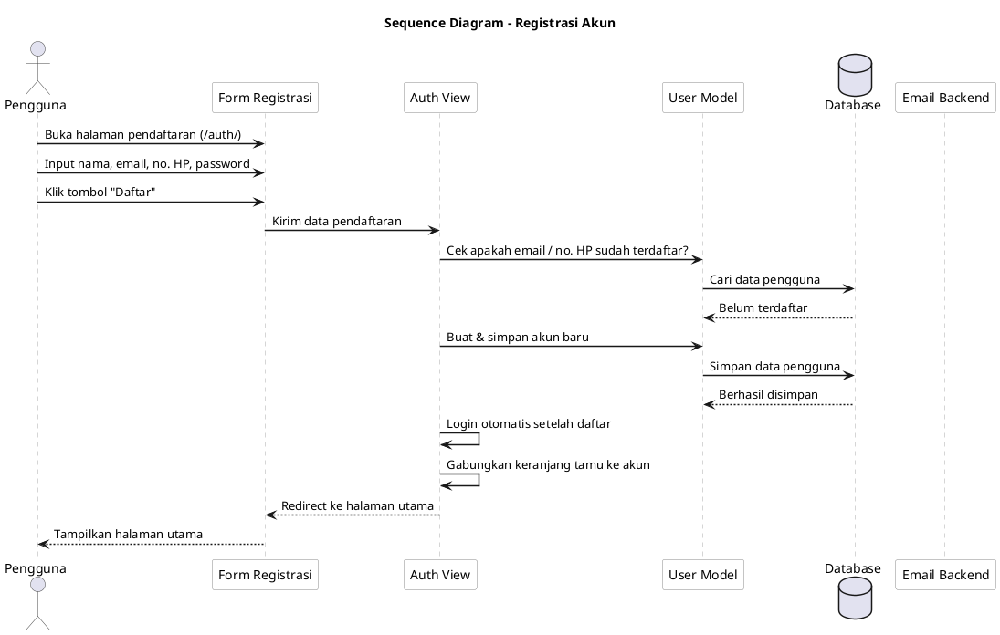
```plantuml
@startuml Registrasi_Akun
title Sequence Diagram - Registrasi Akun

skinparam sequenceArrowThickness 1.5
skinparam roundcorner 5
skinparam sequenceParticipantBackgroundColor #FFFFFF
skinparam sequenceParticipantBorderColor #888888
skinparam sequenceLifeLineBorderColor #AAAAAA
skinparam actorBorderColor #444444
skinparam noteBorderColor #CCCCCC
skinparam noteBackgroundColor #FFFDE7

actor Pengguna as U
participant "Form Registrasi" as F
participant "Auth View" as A
participant "User Model" as M
database "Database" as DB
participant "Email Backend" as E

U -> F : Buka halaman pendaftaran (/auth/)
U -> F : Input nama, email, no. HP, password
U -> F : Klik tombol "Daftar"
F -> A : Kirim data pendaftaran

A -> M : Cek apakah email / no. HP sudah terdaftar?
M -> DB : Cari data pengguna
DB --> M : Belum terdaftar

A -> M : Buat & simpan akun baru
M -> DB : Simpan data pengguna
DB --> M : Berhasil disimpan

A -> A : Login otomatis setelah daftar
A -> A : Gabungkan keranjang tamu ke akun

A --> F : Redirect ke halaman utama
F --> U : Tampilkan halaman utama

@enduml
```

---

## 2. Login Akun

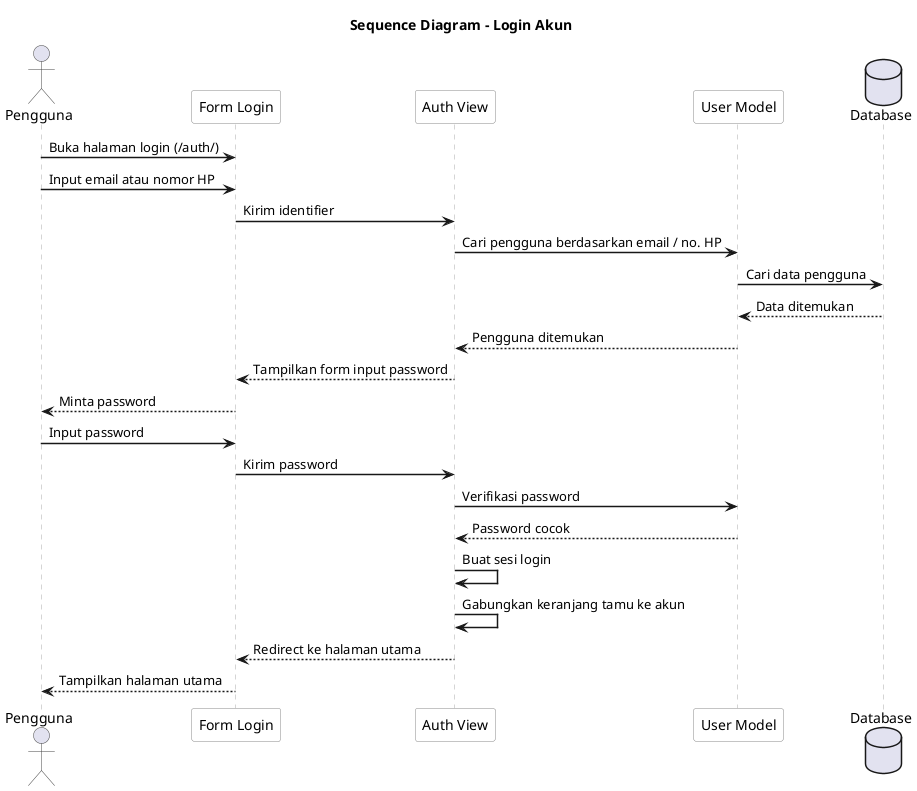
```plantuml
@startuml Login_Akun
title Sequence Diagram - Login Akun

skinparam sequenceArrowThickness 1.5
skinparam roundcorner 5
skinparam sequenceParticipantBackgroundColor #FFFFFF
skinparam sequenceParticipantBorderColor #888888
skinparam sequenceLifeLineBorderColor #AAAAAA
skinparam actorBorderColor #444444

actor Pengguna as U
participant "Form Login" as F
participant "Auth View" as A
participant "User Model" as M
database "Database" as DB

U -> F : Buka halaman login (/auth/)
U -> F : Input email atau nomor HP
F -> A : Kirim identifier

A -> M : Cari pengguna berdasarkan email / no. HP
M -> DB : Cari data pengguna
DB --> M : Data ditemukan
M --> A : Pengguna ditemukan

A --> F : Tampilkan form input password
F --> U : Minta password

U -> F : Input password
F -> A : Kirim password

A -> M : Verifikasi password
M --> A : Password cocok

A -> A : Buat sesi login
A -> A : Gabungkan keranjang tamu ke akun
A --> F : Redirect ke halaman utama
F --> U : Tampilkan halaman utama

@enduml
```

---

## 3. Login dengan Google OAuth

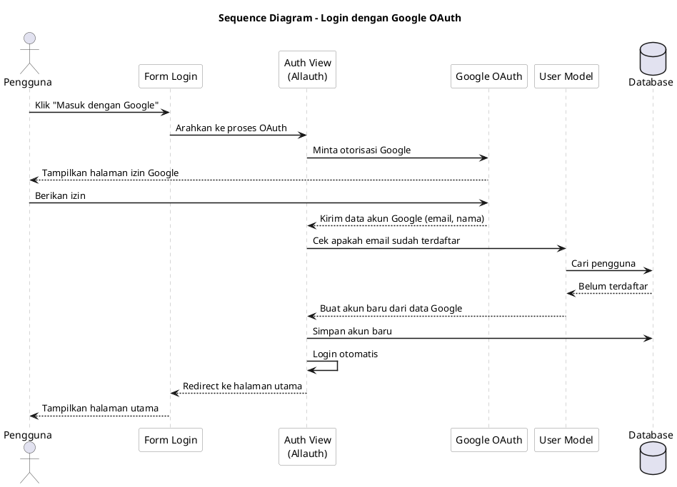
```plantuml
@startuml Login_Google_OAuth
title Sequence Diagram - Login dengan Google OAuth

skinparam sequenceArrowThickness 1.5
skinparam roundcorner 5
skinparam sequenceParticipantBackgroundColor #FFFFFF
skinparam sequenceParticipantBorderColor #888888
skinparam sequenceLifeLineBorderColor #AAAAAA
skinparam actorBorderColor #444444

actor Pengguna as U
participant "Form Login" as F
participant "Auth View\n(Allauth)" as A
participant "Google OAuth" as G
participant "User Model" as M
database "Database" as DB

U -> F : Klik "Masuk dengan Google"
F -> A : Arahkan ke proses OAuth
A -> G : Minta otorisasi Google

G --> U : Tampilkan halaman izin Google
U -> G : Berikan izin

G --> A : Kirim data akun Google (email, nama)

A -> M : Cek apakah email sudah terdaftar
M -> DB : Cari pengguna
DB --> M : Belum terdaftar
M --> A : Buat akun baru dari data Google
A -> DB : Simpan akun baru

A -> A : Login otomatis
A --> F : Redirect ke halaman utama
F --> U : Tampilkan halaman utama

@enduml
```

---

## 4. Lupa Password

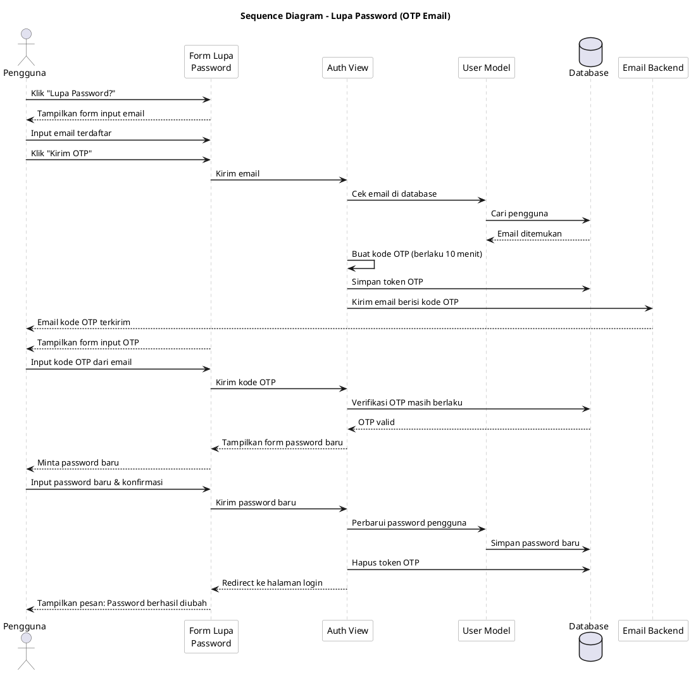
```plantuml
@startuml Lupa_Password
title Sequence Diagram - Lupa Password (OTP Email)

skinparam sequenceArrowThickness 1.5
skinparam roundcorner 5
skinparam sequenceParticipantBackgroundColor #FFFFFF
skinparam sequenceParticipantBorderColor #888888
skinparam sequenceLifeLineBorderColor #AAAAAA
skinparam actorBorderColor #444444

actor Pengguna as U
participant "Form Lupa\nPassword" as F
participant "Auth View" as A
participant "User Model" as M
database "Database" as DB
participant "Email Backend" as E

U -> F : Klik "Lupa Password?"
F --> U : Tampilkan form input email

U -> F : Input email terdaftar
U -> F : Klik "Kirim OTP"
F -> A : Kirim email

A -> M : Cek email di database
M -> DB : Cari pengguna
DB --> M : Email ditemukan

A -> A : Buat kode OTP (berlaku 10 menit)
A -> DB : Simpan token OTP
A -> E : Kirim email berisi kode OTP
E --> U : Email kode OTP terkirim

F --> U : Tampilkan form input OTP
U -> F : Input kode OTP dari email
F -> A : Kirim kode OTP

A -> DB : Verifikasi OTP masih berlaku
DB --> A : OTP valid

A --> F : Tampilkan form password baru
F --> U : Minta password baru

U -> F : Input password baru & konfirmasi
F -> A : Kirim password baru

A -> M : Perbarui password pengguna
M -> DB : Simpan password baru
A -> DB : Hapus token OTP

A --> F : Redirect ke halaman login
F --> U : Tampilkan pesan: Password berhasil diubah

@enduml
```

---

## 5. Melihat Katalog & Filter Produk

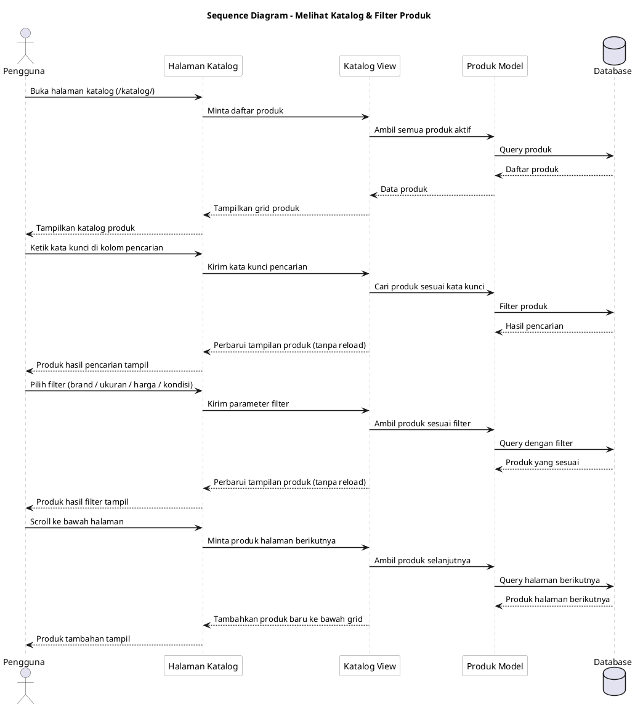
```plantuml
@startuml Katalog_Filter
title Sequence Diagram - Melihat Katalog & Filter Produk

skinparam sequenceArrowThickness 1.5
skinparam roundcorner 5
skinparam sequenceParticipantBackgroundColor #FFFFFF
skinparam sequenceParticipantBorderColor #888888
skinparam sequenceLifeLineBorderColor #AAAAAA
skinparam actorBorderColor #444444

actor Pengguna as U
participant "Halaman Katalog" as K
participant "Katalog View" as V
participant "Produk Model" as M
database "Database" as DB

U -> K : Buka halaman katalog (/katalog/)
K -> V : Minta daftar produk
V -> M : Ambil semua produk aktif
M -> DB : Query produk
DB --> M : Daftar produk
M --> V : Data produk
V --> K : Tampilkan grid produk
K --> U : Tampilkan katalog produk

U -> K : Ketik kata kunci di kolom pencarian
K -> V : Kirim kata kunci pencarian
V -> M : Cari produk sesuai kata kunci
M -> DB : Filter produk
DB --> M : Hasil pencarian
V --> K : Perbarui tampilan produk (tanpa reload)
K --> U : Produk hasil pencarian tampil

U -> K : Pilih filter (brand / ukuran / harga / kondisi)
K -> V : Kirim parameter filter
V -> M : Ambil produk sesuai filter
M -> DB : Query dengan filter
DB --> M : Produk yang sesuai
V --> K : Perbarui tampilan produk (tanpa reload)
K --> U : Produk hasil filter tampil

U -> K : Scroll ke bawah halaman
K -> V : Minta produk halaman berikutnya
V -> M : Ambil produk selanjutnya
M -> DB : Query halaman berikutnya
DB --> M : Produk halaman berikutnya
V --> K : Tambahkan produk baru ke bawah grid
K --> U : Produk tambahan tampil

@enduml
```

---

## 6. Melihat Detail Produk

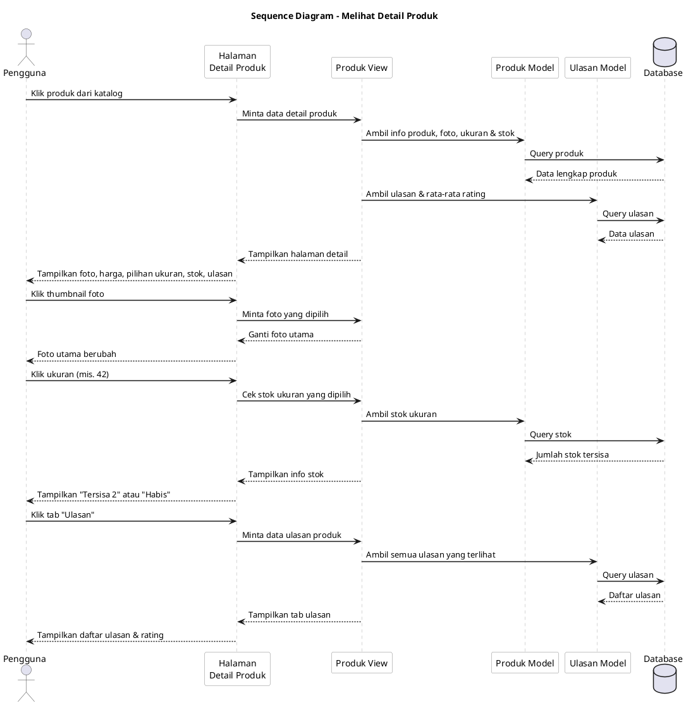
```plantuml
@startuml Detail_Produk
title Sequence Diagram - Melihat Detail Produk

skinparam sequenceArrowThickness 1.5
skinparam roundcorner 5
skinparam sequenceParticipantBackgroundColor #FFFFFF
skinparam sequenceParticipantBorderColor #888888
skinparam sequenceLifeLineBorderColor #AAAAAA
skinparam actorBorderColor #444444

actor Pengguna as U
participant "Halaman\nDetail Produk" as H
participant "Produk View" as V
participant "Produk Model" as M
participant "Ulasan Model" as UM
database "Database" as DB

U -> H : Klik produk dari katalog
H -> V : Minta data detail produk
V -> M : Ambil info produk, foto, ukuran & stok
M -> DB : Query produk
DB --> M : Data lengkap produk
V -> UM : Ambil ulasan & rata-rata rating
UM -> DB : Query ulasan
DB --> UM : Data ulasan
V --> H : Tampilkan halaman detail
H --> U : Tampilkan foto, harga, pilihan ukuran, stok, ulasan

U -> H : Klik thumbnail foto
H -> V : Minta foto yang dipilih
V --> H : Ganti foto utama
H --> U : Foto utama berubah

U -> H : Klik ukuran (mis. 42)
H -> V : Cek stok ukuran yang dipilih
V -> M : Ambil stok ukuran
M -> DB : Query stok
DB --> M : Jumlah stok tersisa
V --> H : Tampilkan info stok
H --> U : Tampilkan "Tersisa 2" atau "Habis"

U -> H : Klik tab "Ulasan"
H -> V : Minta data ulasan produk
V -> UM : Ambil semua ulasan yang terlihat
UM -> DB : Query ulasan
DB --> UM : Daftar ulasan
V --> H : Tampilkan tab ulasan
H --> U : Tampilkan daftar ulasan & rating

@enduml
```

---

## 7. Tambah ke Keranjang

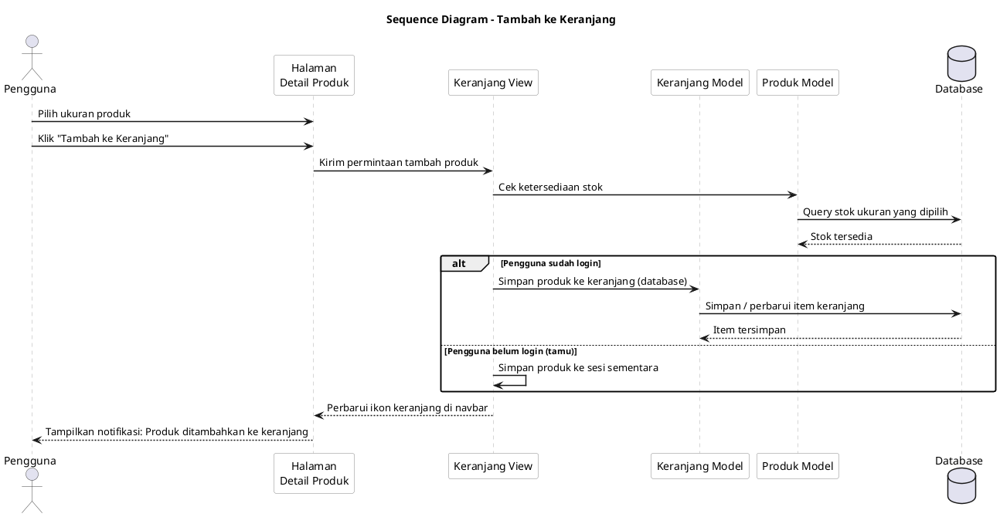
```plantuml
@startuml Tambah_Keranjang
title Sequence Diagram - Tambah ke Keranjang

skinparam sequenceArrowThickness 1.5
skinparam roundcorner 5
skinparam sequenceParticipantBackgroundColor #FFFFFF
skinparam sequenceParticipantBorderColor #888888
skinparam sequenceLifeLineBorderColor #AAAAAA
skinparam actorBorderColor #444444

actor Pengguna as U
participant "Halaman\nDetail Produk" as H
participant "Keranjang View" as V
participant "Keranjang Model" as K
participant "Produk Model" as M
database "Database" as DB

U -> H : Pilih ukuran produk
U -> H : Klik "Tambah ke Keranjang"
H -> V : Kirim permintaan tambah produk

V -> M : Cek ketersediaan stok
M -> DB : Query stok ukuran yang dipilih
DB --> M : Stok tersedia

alt Pengguna sudah login
    V -> K : Simpan produk ke keranjang (database)
    K -> DB : Simpan / perbarui item keranjang
    DB --> K : Item tersimpan
else Pengguna belum login (tamu)
    V -> V : Simpan produk ke sesi sementara
end

V --> H : Perbarui ikon keranjang di navbar
H --> U : Tampilkan notifikasi: Produk ditambahkan ke keranjang

@enduml
```

---

## 8. Kelola Wishlist

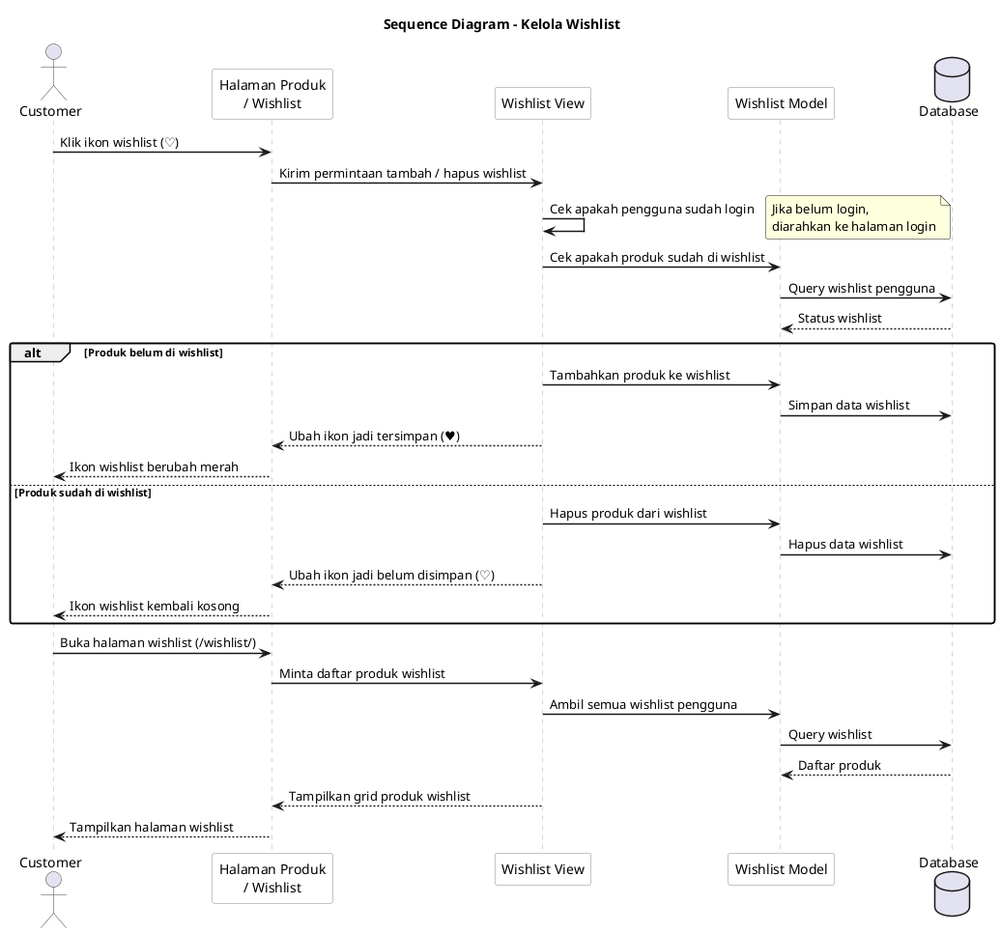
```plantuml
@startuml Kelola_Wishlist
title Sequence Diagram - Kelola Wishlist

skinparam sequenceArrowThickness 1.5
skinparam roundcorner 5
skinparam sequenceParticipantBackgroundColor #FFFFFF
skinparam sequenceParticipantBorderColor #888888
skinparam sequenceLifeLineBorderColor #AAAAAA
skinparam actorBorderColor #444444

actor Customer as U
participant "Halaman Produk\n/ Wishlist" as H
participant "Wishlist View" as V
participant "Wishlist Model" as W
database "Database" as DB

U -> H : Klik ikon wishlist (♡)
H -> V : Kirim permintaan tambah / hapus wishlist

V -> V : Cek apakah pengguna sudah login
note right : Jika belum login,\ndiarahkan ke halaman login

V -> W : Cek apakah produk sudah di wishlist
W -> DB : Query wishlist pengguna
DB --> W : Status wishlist

alt Produk belum di wishlist
    V -> W : Tambahkan produk ke wishlist
    W -> DB : Simpan data wishlist
    V --> H : Ubah ikon jadi tersimpan (♥)
    H --> U : Ikon wishlist berubah merah
else Produk sudah di wishlist
    V -> W : Hapus produk dari wishlist
    W -> DB : Hapus data wishlist
    V --> H : Ubah ikon jadi belum disimpan (♡)
    H --> U : Ikon wishlist kembali kosong
end

U -> H : Buka halaman wishlist (/wishlist/)
H -> V : Minta daftar produk wishlist
V -> W : Ambil semua wishlist pengguna
W -> DB : Query wishlist
DB --> W : Daftar produk
V --> H : Tampilkan grid produk wishlist
H --> U : Tampilkan halaman wishlist

@enduml
```

---

## 9. Checkout & Pembayaran

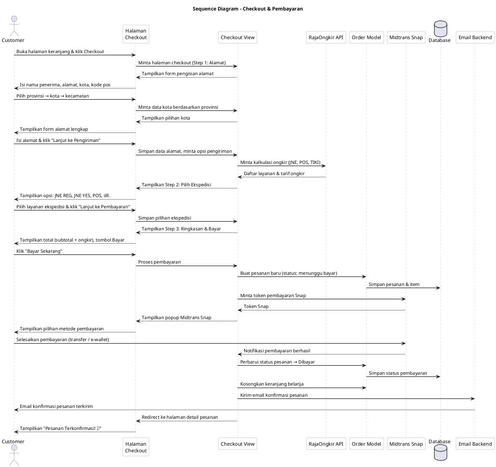
```plantuml
@startuml Checkout_Pembayaran
title Sequence Diagram - Checkout & Pembayaran

skinparam sequenceArrowThickness 1.5
skinparam roundcorner 5
skinparam sequenceParticipantBackgroundColor #FFFFFF
skinparam sequenceParticipantBorderColor #888888
skinparam sequenceLifeLineBorderColor #AAAAAA
skinparam actorBorderColor #444444

actor Customer as U
participant "Halaman\nCheckout" as H
participant "Checkout View" as V
participant "RajaOngkir API" as R
participant "Order Model" as O
participant "Midtrans Snap" as M
database "Database" as DB
participant "Email Backend" as E

U -> H : Buka halaman keranjang & klik Checkout
H -> V : Minta halaman checkout (Step 1: Alamat)
V --> H : Tampilkan form pengisian alamat
H --> U : Isi nama penerima, alamat, kota, kode pos

U -> H : Pilih provinsi → kota → kecamatan
H -> V : Minta data kota berdasarkan provinsi
V --> H : Tampilkan pilihan kota
H --> U : Tampilkan form alamat lengkap

U -> H : Isi alamat & klik "Lanjut ke Pengiriman"
H -> V : Simpan data alamat, minta opsi pengiriman
V -> R : Minta kalkulasi ongkir (JNE, POS, TIKI)
R --> V : Daftar layanan & tarif ongkir
V --> H : Tampilkan Step 2: Pilih Ekspedisi
H --> U : Tampilkan opsi: JNE REG, JNE YES, POS, dll.

U -> H : Pilih layanan ekspedisi & klik "Lanjut ke Pembayaran"
H -> V : Simpan pilihan ekspedisi
V --> H : Tampilkan Step 3: Ringkasan & Bayar
H --> U : Tampilkan total (subtotal + ongkir), tombol Bayar

U -> H : Klik "Bayar Sekarang"
H -> V : Proses pembayaran
V -> O : Buat pesanan baru (status: menunggu bayar)
O -> DB : Simpan pesanan & item
V -> M : Minta token pembayaran Snap
M --> V : Token Snap
V --> H : Tampilkan popup Midtrans Snap
H --> U : Tampilkan pilihan metode pembayaran

U -> M : Selesaikan pembayaran (transfer / e-wallet)
M --> V : Notifikasi pembayaran berhasil
V -> O : Perbarui status pesanan → Dibayar
O -> DB : Simpan status pembayaran
V -> O : Kosongkan keranjang belanja
V -> E : Kirim email konfirmasi pesanan
E --> U : Email konfirmasi pesanan terkirim
V --> H : Redirect ke halaman detail pesanan
H --> U : Tampilkan "Pesanan Terkonfirmasi! 🎉"

@enduml
```

---

## 10. Tracking Status Pesanan

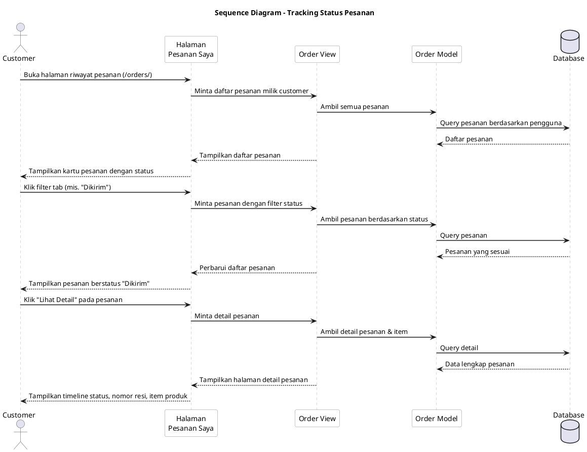
```plantuml
@startuml Tracking_Pesanan
title Sequence Diagram - Tracking Status Pesanan

skinparam sequenceArrowThickness 1.5
skinparam roundcorner 5
skinparam sequenceParticipantBackgroundColor #FFFFFF
skinparam sequenceParticipantBorderColor #888888
skinparam sequenceLifeLineBorderColor #AAAAAA
skinparam actorBorderColor #444444

actor Customer as U
participant "Halaman\nPesanan Saya" as H
participant "Order View" as V
participant "Order Model" as O
database "Database" as DB

U -> H : Buka halaman riwayat pesanan (/orders/)
H -> V : Minta daftar pesanan milik customer
V -> O : Ambil semua pesanan
O -> DB : Query pesanan berdasarkan pengguna
DB --> O : Daftar pesanan
V --> H : Tampilkan daftar pesanan
H --> U : Tampilkan kartu pesanan dengan status

U -> H : Klik filter tab (mis. "Dikirim")
H -> V : Minta pesanan dengan filter status
V -> O : Ambil pesanan berdasarkan status
O -> DB : Query pesanan
DB --> O : Pesanan yang sesuai
V --> H : Perbarui daftar pesanan
H --> U : Tampilkan pesanan berstatus "Dikirim"

U -> H : Klik "Lihat Detail" pada pesanan
H -> V : Minta detail pesanan
V -> O : Ambil detail pesanan & item
O -> DB : Query detail
DB --> O : Data lengkap pesanan
V --> H : Tampilkan halaman detail pesanan
H --> U : Tampilkan timeline status, nomor resi, item produk

@enduml
```

---

## 11. Konfirmasi Penerimaan Pesanan

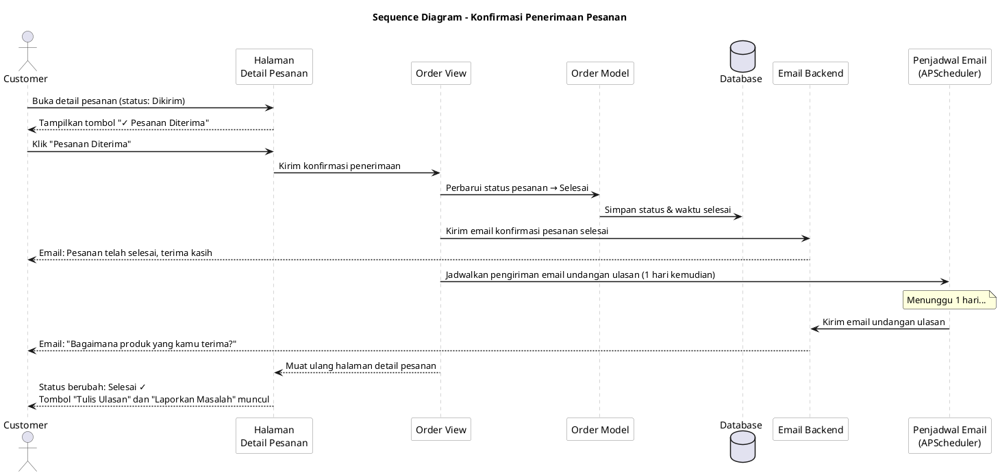
```plantuml
@startuml Konfirmasi_Penerimaan
title Sequence Diagram - Konfirmasi Penerimaan Pesanan

skinparam sequenceArrowThickness 1.5
skinparam roundcorner 5
skinparam sequenceParticipantBackgroundColor #FFFFFF
skinparam sequenceParticipantBorderColor #888888
skinparam sequenceLifeLineBorderColor #AAAAAA
skinparam actorBorderColor #444444

actor Customer as U
participant "Halaman\nDetail Pesanan" as H
participant "Order View" as V
participant "Order Model" as O
database "Database" as DB
participant "Email Backend" as E
participant "Penjadwal Email\n(APScheduler)" as S

U -> H : Buka detail pesanan (status: Dikirim)
H --> U : Tampilkan tombol "✓ Pesanan Diterima"

U -> H : Klik "Pesanan Diterima"
H -> V : Kirim konfirmasi penerimaan
V -> O : Perbarui status pesanan → Selesai
O -> DB : Simpan status & waktu selesai

V -> E : Kirim email konfirmasi pesanan selesai
E --> U : Email: Pesanan telah selesai, terima kasih

V -> S : Jadwalkan pengiriman email undangan ulasan (1 hari kemudian)

note over S : Menunggu 1 hari...

S -> E : Kirim email undangan ulasan
E --> U : Email: "Bagaimana produk yang kamu terima?"

V --> H : Muat ulang halaman detail pesanan
H --> U : Status berubah: Selesai ✓\nTombol "Tulis Ulasan" dan "Laporkan Masalah" muncul

@enduml
```

---

## 12. Tulis Ulasan Produk

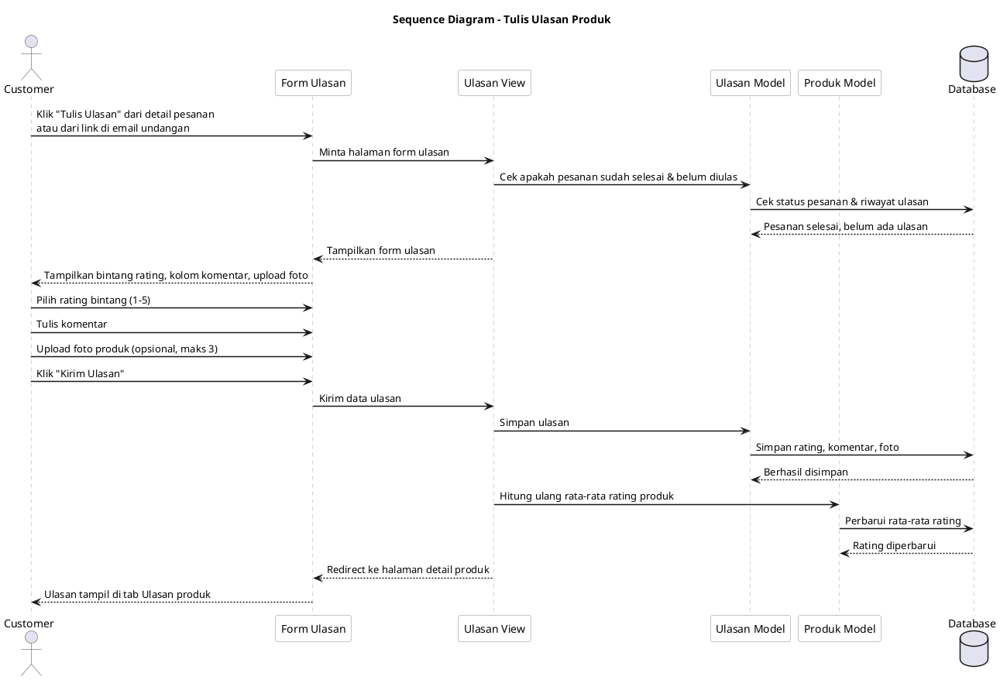
```plantuml
@startuml Tulis_Ulasan
title Sequence Diagram - Tulis Ulasan Produk

skinparam sequenceArrowThickness 1.5
skinparam roundcorner 5
skinparam sequenceParticipantBackgroundColor #FFFFFF
skinparam sequenceParticipantBorderColor #888888
skinparam sequenceLifeLineBorderColor #AAAAAA
skinparam actorBorderColor #444444

actor Customer as U
participant "Form Ulasan" as F
participant "Ulasan View" as V
participant "Ulasan Model" as M
participant "Produk Model" as P
database "Database" as DB

U -> F : Klik "Tulis Ulasan" dari detail pesanan\natau dari link di email undangan
F -> V : Minta halaman form ulasan
V -> M : Cek apakah pesanan sudah selesai & belum diulas
M -> DB : Cek status pesanan & riwayat ulasan
DB --> M : Pesanan selesai, belum ada ulasan
V --> F : Tampilkan form ulasan
F --> U : Tampilkan bintang rating, kolom komentar, upload foto

U -> F : Pilih rating bintang (1–5)
U -> F : Tulis komentar
U -> F : Upload foto produk (opsional, maks 3)
U -> F : Klik "Kirim Ulasan"
F -> V : Kirim data ulasan

V -> M : Simpan ulasan
M -> DB : Simpan rating, komentar, foto
DB --> M : Berhasil disimpan

V -> P : Hitung ulang rata-rata rating produk
P -> DB : Perbarui rata-rata rating
DB --> P : Rating diperbarui

V --> F : Redirect ke halaman detail produk
F --> U : Ulasan tampil di tab Ulasan produk

@enduml
```

---

## 13. Laporan Garansi / Kendala Produk

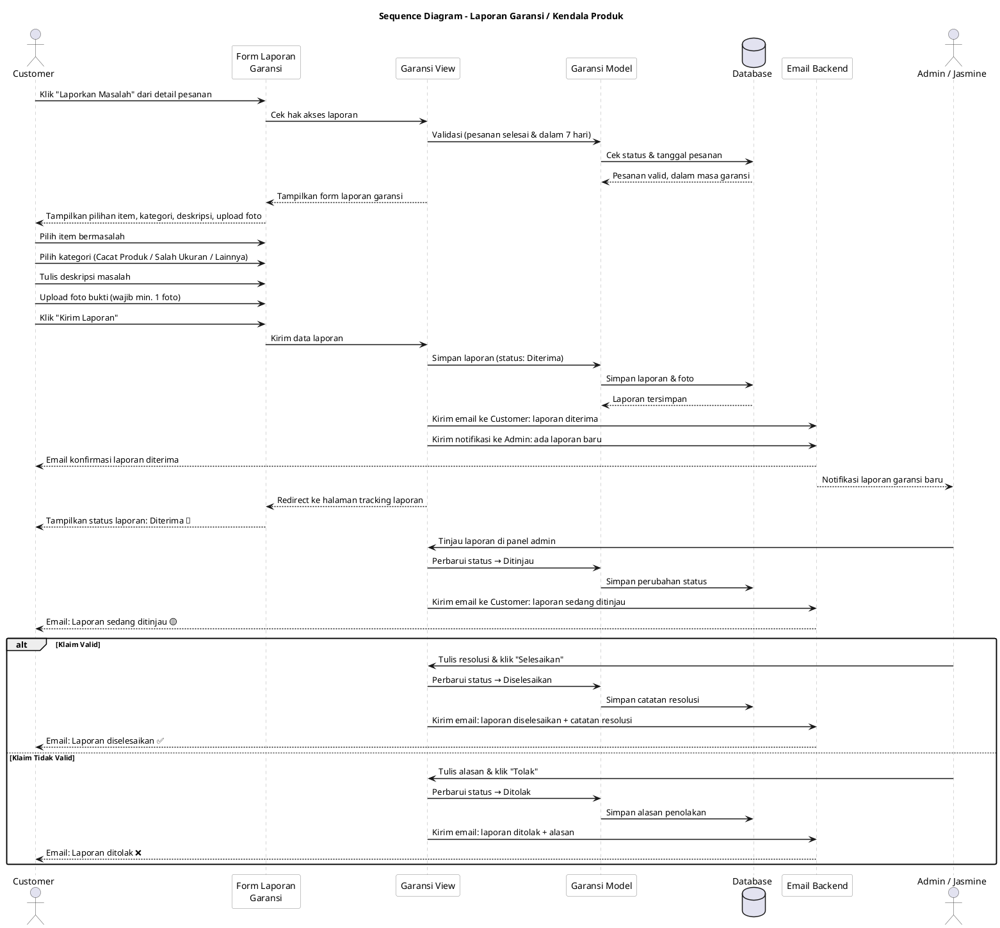
```plantuml
@startuml Laporan_Garansi
title Sequence Diagram - Laporan Garansi / Kendala Produk

skinparam sequenceArrowThickness 1.5
skinparam roundcorner 5
skinparam sequenceParticipantBackgroundColor #FFFFFF
skinparam sequenceParticipantBorderColor #888888
skinparam sequenceLifeLineBorderColor #AAAAAA
skinparam actorBorderColor #444444

actor Customer as U
participant "Form Laporan\nGaransi" as F
participant "Garansi View" as V
participant "Garansi Model" as G
database "Database" as DB
participant "Email Backend" as E
actor "Admin / Jasmine" as A

U -> F : Klik "Laporkan Masalah" dari detail pesanan
F -> V : Cek hak akses laporan
V -> G : Validasi (pesanan selesai & dalam 7 hari)
G -> DB : Cek status & tanggal pesanan
DB --> G : Pesanan valid, dalam masa garansi
V --> F : Tampilkan form laporan garansi
F --> U : Tampilkan pilihan item, kategori, deskripsi, upload foto

U -> F : Pilih item bermasalah
U -> F : Pilih kategori (Cacat Produk / Salah Ukuran / Lainnya)
U -> F : Tulis deskripsi masalah
U -> F : Upload foto bukti (wajib min. 1 foto)
U -> F : Klik "Kirim Laporan"
F -> V : Kirim data laporan

V -> G : Simpan laporan (status: Diterima)
G -> DB : Simpan laporan & foto
DB --> G : Laporan tersimpan

V -> E : Kirim email ke Customer: laporan diterima
V -> E : Kirim notifikasi ke Admin: ada laporan baru
E --> U : Email konfirmasi laporan diterima
E --> A : Notifikasi laporan garansi baru

V --> F : Redirect ke halaman tracking laporan
F --> U : Tampilkan status laporan: Diterima 🔵

A -> V : Tinjau laporan di panel admin
V -> G : Perbarui status → Ditinjau
G -> DB : Simpan perubahan status
V -> E : Kirim email ke Customer: laporan sedang ditinjau
E --> U : Email: Laporan sedang ditinjau 🟡

alt Klaim Valid
    A -> V : Tulis resolusi & klik "Selesaikan"
    V -> G : Perbarui status → Diselesaikan
    G -> DB : Simpan catatan resolusi
    V -> E : Kirim email: laporan diselesaikan + catatan resolusi
    E --> U : Email: Laporan diselesaikan ✅
else Klaim Tidak Valid
    A -> V : Tulis alasan & klik "Tolak"
    V -> G : Perbarui status → Ditolak
    G -> DB : Simpan alasan penolakan
    V -> E : Kirim email: laporan ditolak + alasan
    E --> U : Email: Laporan ditolak ❌
end

@enduml
```

---

## 14. Admin Toko — Kelola Produk & Stok

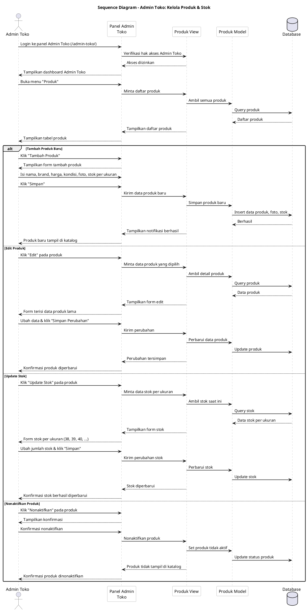
```plantuml
@startuml Admin_Kelola_Produk
title Sequence Diagram - Admin Toko: Kelola Produk & Stok

skinparam sequenceArrowThickness 1.5
skinparam roundcorner 5
skinparam sequenceParticipantBackgroundColor #FFFFFF
skinparam sequenceParticipantBorderColor #888888
skinparam sequenceLifeLineBorderColor #AAAAAA
skinparam actorBorderColor #444444

actor "Admin Toko" as A
participant "Panel Admin\nToko" as P
participant "Produk View" as V
participant "Produk Model" as M
database "Database" as DB

A -> P : Login ke panel Admin Toko (/admin-toko/)
P -> V : Verifikasi hak akses Admin Toko
V --> P : Akses diizinkan
P --> A : Tampilkan dashboard Admin Toko

A -> P : Buka menu "Produk"
P -> V : Minta daftar produk
V -> M : Ambil semua produk
M -> DB : Query produk
DB --> M : Daftar produk
V --> P : Tampilkan daftar produk
P --> A : Tampilkan tabel produk

alt Tambah Produk Baru
    A -> P : Klik "Tambah Produk"
    P --> A : Tampilkan form tambah produk
    A -> P : Isi nama, brand, harga, kondisi, foto, stok per ukuran
    A -> P : Klik "Simpan"
    P -> V : Kirim data produk baru
    V -> M : Simpan produk baru
    M -> DB : Insert data produk, foto, stok
    DB --> M : Berhasil
    V --> P : Tampilkan notifikasi berhasil
    P --> A : Produk baru tampil di katalog

else Edit Produk
    A -> P : Klik "Edit" pada produk
    P -> V : Minta data produk yang dipilih
    V -> M : Ambil detail produk
    M -> DB : Query produk
    DB --> M : Data produk
    V --> P : Tampilkan form edit
    P --> A : Form terisi data produk lama
    A -> P : Ubah data & klik "Simpan Perubahan"
    P -> V : Kirim perubahan
    V -> M : Perbarui data produk
    M -> DB : Update produk
    V --> P : Perubahan tersimpan
    P --> A : Konfirmasi produk diperbarui

else Update Stok
    A -> P : Klik "Update Stok" pada produk
    P -> V : Minta data stok per ukuran
    V -> M : Ambil stok saat ini
    M -> DB : Query stok
    DB --> M : Data stok per ukuran
    V --> P : Tampilkan form stok
    P --> A : Form stok per ukuran (38, 39, 40, ...)
    A -> P : Ubah jumlah stok & klik "Simpan"
    P -> V : Kirim perubahan stok
    V -> M : Perbarui stok
    M -> DB : Update stok
    V --> P : Stok diperbarui
    P --> A : Konfirmasi stok berhasil diperbarui

else Nonaktifkan Produk
    A -> P : Klik "Nonaktifkan" pada produk
    P --> A : Tampilkan konfirmasi
    A -> P : Konfirmasi nonaktifkan
    P -> V : Nonaktifkan produk
    V -> M : Set produk tidak aktif
    M -> DB : Update status produk
    V --> P : Produk tidak tampil di katalog
    P --> A : Konfirmasi produk dinonaktifkan
end

@enduml
```

---

## 15. Admin Toko — Proses Pesanan & Input Resi

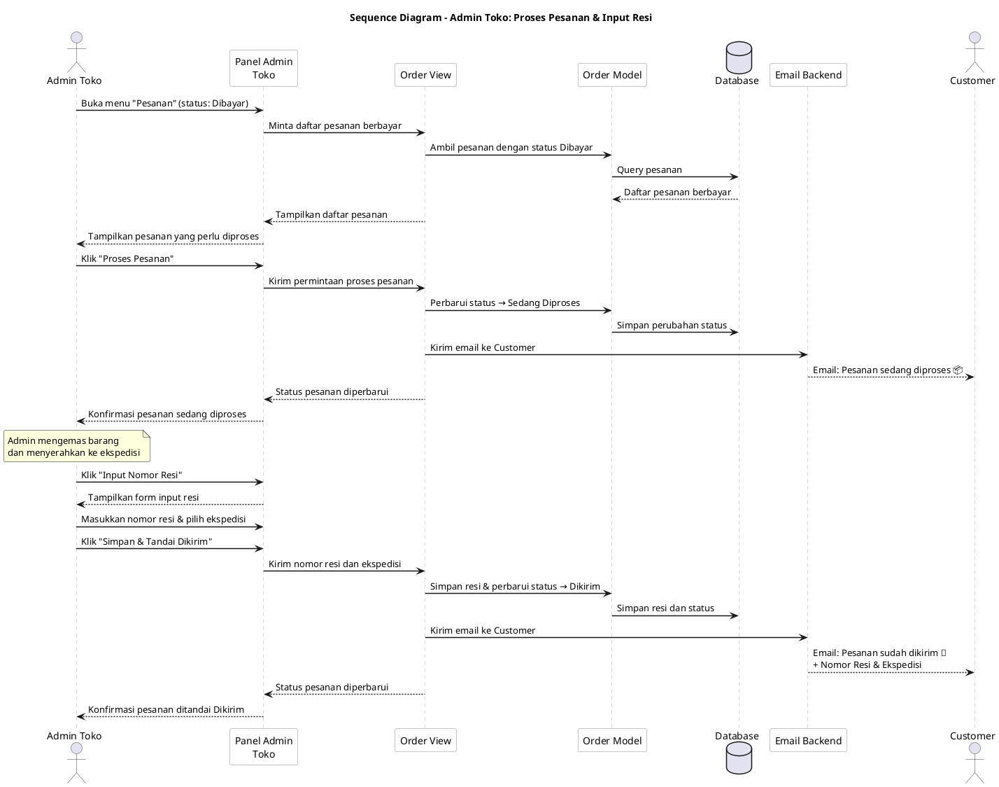
```plantuml
@startuml Admin_Proses_Pesanan
title Sequence Diagram - Admin Toko: Proses Pesanan & Input Resi

skinparam sequenceArrowThickness 1.5
skinparam roundcorner 5
skinparam sequenceParticipantBackgroundColor #FFFFFF
skinparam sequenceParticipantBorderColor #888888
skinparam sequenceLifeLineBorderColor #AAAAAA
skinparam actorBorderColor #444444

actor "Admin Toko" as A
participant "Panel Admin\nToko" as P
participant "Order View" as V
participant "Order Model" as O
database "Database" as DB
participant "Email Backend" as E
actor "Customer" as U

A -> P : Buka menu "Pesanan" (status: Dibayar)
P -> V : Minta daftar pesanan berbayar
V -> O : Ambil pesanan dengan status Dibayar
O -> DB : Query pesanan
DB --> O : Daftar pesanan berbayar
V --> P : Tampilkan daftar pesanan
P --> A : Tampilkan pesanan yang perlu diproses

A -> P : Klik "Proses Pesanan"
P -> V : Kirim permintaan proses pesanan
V -> O : Perbarui status → Sedang Diproses
O -> DB : Simpan perubahan status
V -> E : Kirim email ke Customer
E --> U : Email: Pesanan sedang diproses 📦
V --> P : Status pesanan diperbarui
P --> A : Konfirmasi pesanan sedang diproses

note over A : Admin mengemas barang\ndan menyerahkan ke ekspedisi

A -> P : Klik "Input Nomor Resi"
P --> A : Tampilkan form input resi

A -> P : Masukkan nomor resi & pilih ekspedisi
A -> P : Klik "Simpan & Tandai Dikirim"
P -> V : Kirim nomor resi dan ekspedisi
V -> O : Simpan resi & perbarui status → Dikirim
O -> DB : Simpan resi dan status
V -> E : Kirim email ke Customer
E --> U : Email: Pesanan sudah dikirim 🚚\n+ Nomor Resi & Ekspedisi
V --> P : Status pesanan diperbarui
P --> A : Konfirmasi pesanan ditandai Dikirim

@enduml
```

---

## 16. Admin Toko — Moderasi Ulasan

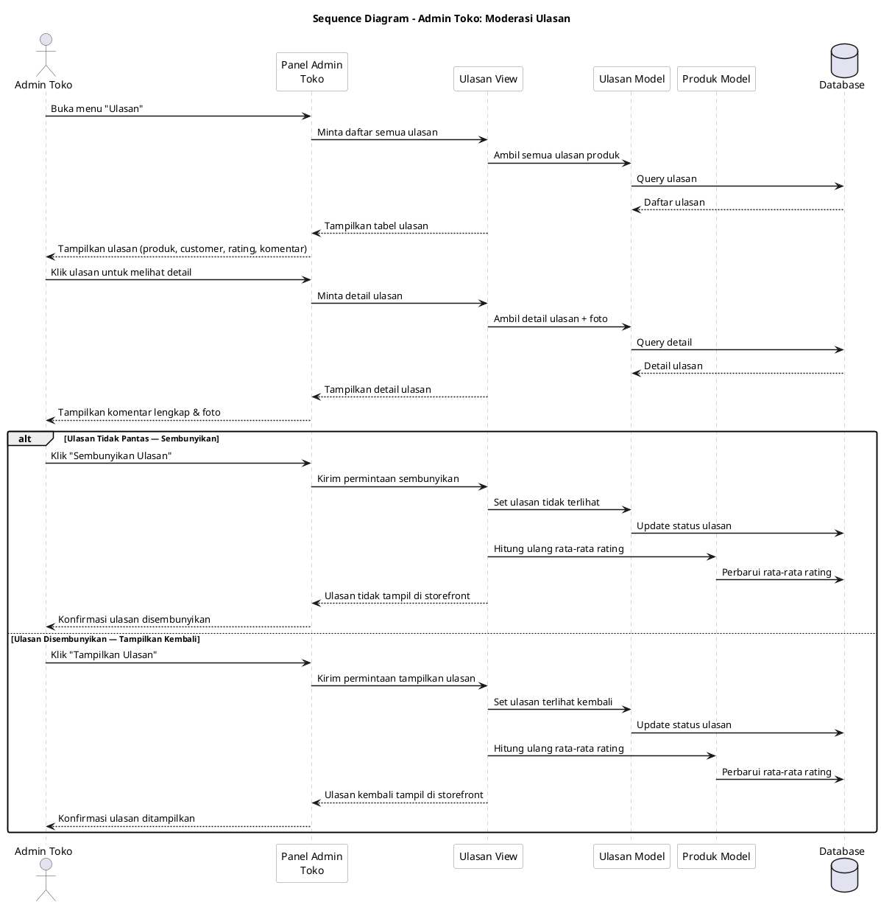
```plantuml
@startuml Admin_Moderasi_Ulasan
title Sequence Diagram - Admin Toko: Moderasi Ulasan

skinparam sequenceArrowThickness 1.5
skinparam roundcorner 5
skinparam sequenceParticipantBackgroundColor #FFFFFF
skinparam sequenceParticipantBorderColor #888888
skinparam sequenceLifeLineBorderColor #AAAAAA
skinparam actorBorderColor #444444

actor "Admin Toko" as A
participant "Panel Admin\nToko" as P
participant "Ulasan View" as V
participant "Ulasan Model" as M
participant "Produk Model" as PM
database "Database" as DB

A -> P : Buka menu "Ulasan"
P -> V : Minta daftar semua ulasan
V -> M : Ambil semua ulasan produk
M -> DB : Query ulasan
DB --> M : Daftar ulasan
V --> P : Tampilkan tabel ulasan
P --> A : Tampilkan ulasan (produk, customer, rating, komentar)

A -> P : Klik ulasan untuk melihat detail
P -> V : Minta detail ulasan
V -> M : Ambil detail ulasan + foto
M -> DB : Query detail
DB --> M : Detail ulasan
V --> P : Tampilkan detail ulasan
P --> A : Tampilkan komentar lengkap & foto

alt Ulasan Tidak Pantas — Sembunyikan
    A -> P : Klik "Sembunyikan Ulasan"
    P -> V : Kirim permintaan sembunyikan
    V -> M : Set ulasan tidak terlihat
    M -> DB : Update status ulasan
    V -> PM : Hitung ulang rata-rata rating
    PM -> DB : Perbarui rata-rata rating
    V --> P : Ulasan tidak tampil di storefront
    P --> A : Konfirmasi ulasan disembunyikan

else Ulasan Disembunyikan — Tampilkan Kembali
    A -> P : Klik "Tampilkan Ulasan"
    P -> V : Kirim permintaan tampilkan ulasan
    V -> M : Set ulasan terlihat kembali
    M -> DB : Update status ulasan
    V -> PM : Hitung ulang rata-rata rating
    PM -> DB : Perbarui rata-rata rating
    V --> P : Ulasan kembali tampil di storefront
    P --> A : Konfirmasi ulasan ditampilkan
end

@enduml
```

---

## 17. Admin Toko — Tinjau Laporan Garansi

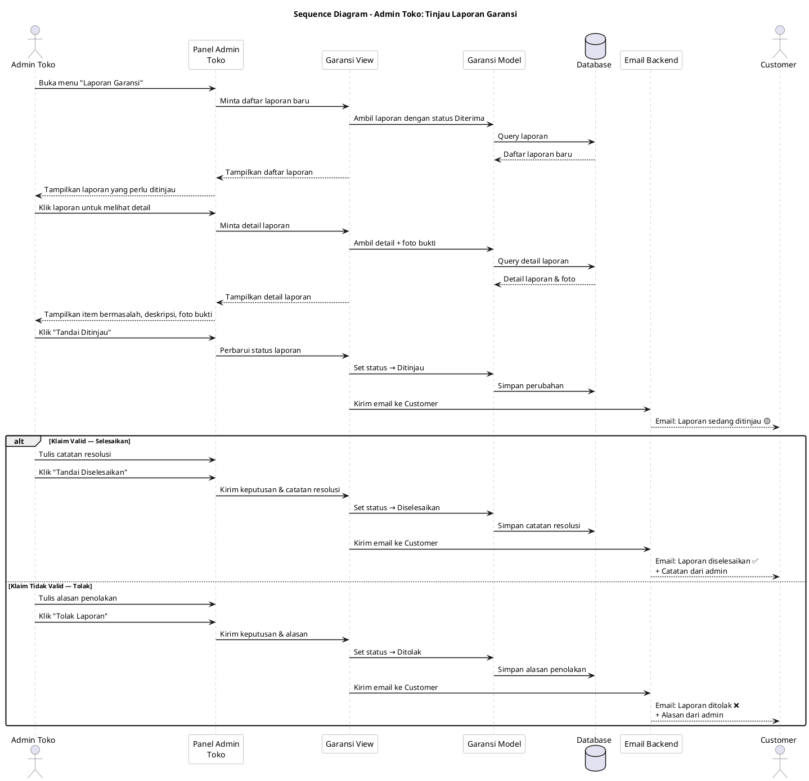
```plantuml
@startuml Admin_Tinjau_Garansi
title Sequence Diagram - Admin Toko: Tinjau Laporan Garansi

skinparam sequenceArrowThickness 1.5
skinparam roundcorner 5
skinparam sequenceParticipantBackgroundColor #FFFFFF
skinparam sequenceParticipantBorderColor #888888
skinparam sequenceLifeLineBorderColor #AAAAAA
skinparam actorBorderColor #444444

actor "Admin Toko" as A
participant "Panel Admin\nToko" as P
participant "Garansi View" as V
participant "Garansi Model" as G
database "Database" as DB
participant "Email Backend" as E
actor "Customer" as U

A -> P : Buka menu "Laporan Garansi"
P -> V : Minta daftar laporan baru
V -> G : Ambil laporan dengan status Diterima
G -> DB : Query laporan
DB --> G : Daftar laporan baru
V --> P : Tampilkan daftar laporan
P --> A : Tampilkan laporan yang perlu ditinjau

A -> P : Klik laporan untuk melihat detail
P -> V : Minta detail laporan
V -> G : Ambil detail + foto bukti
G -> DB : Query detail laporan
DB --> G : Detail laporan & foto
V --> P : Tampilkan detail laporan
P --> A : Tampilkan item bermasalah, deskripsi, foto bukti

A -> P : Klik "Tandai Ditinjau"
P -> V : Perbarui status laporan
V -> G : Set status → Ditinjau
G -> DB : Simpan perubahan
V -> E : Kirim email ke Customer
E --> U : Email: Laporan sedang ditinjau 🟡

alt Klaim Valid — Selesaikan
    A -> P : Tulis catatan resolusi
    A -> P : Klik "Tandai Diselesaikan"
    P -> V : Kirim keputusan & catatan resolusi
    V -> G : Set status → Diselesaikan
    G -> DB : Simpan catatan resolusi
    V -> E : Kirim email ke Customer
    E --> U : Email: Laporan diselesaikan ✅\n+ Catatan dari admin

else Klaim Tidak Valid — Tolak
    A -> P : Tulis alasan penolakan
    A -> P : Klik "Tolak Laporan"
    P -> V : Kirim keputusan & alasan
    V -> G : Set status → Ditolak
    G -> DB : Simpan alasan penolakan
    V -> E : Kirim email ke Customer
    E --> U : Email: Laporan ditolak ❌\n+ Alasan dari admin
end

@enduml
```

---

## 18. Jasmine — Kelola Produk Lengkap

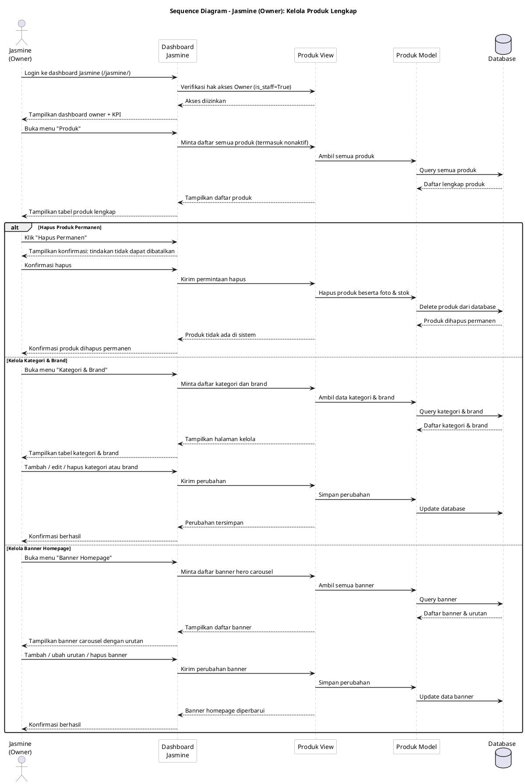
```plantuml
@startuml Jasmine_Kelola_Produk
title Sequence Diagram - Jasmine (Owner): Kelola Produk Lengkap

skinparam sequenceArrowThickness 1.5
skinparam roundcorner 5
skinparam sequenceParticipantBackgroundColor #FFFFFF
skinparam sequenceParticipantBorderColor #888888
skinparam sequenceLifeLineBorderColor #AAAAAA
skinparam actorBorderColor #444444

actor "Jasmine\n(Owner)" as J
participant "Dashboard\nJasmine" as D
participant "Produk View" as V
participant "Produk Model" as M
database "Database" as DB

J -> D : Login ke dashboard Jasmine (/jasmine/)
D -> V : Verifikasi hak akses Owner (is_staff=True)
V --> D : Akses diizinkan
D --> J : Tampilkan dashboard owner + KPI

J -> D : Buka menu "Produk"
D -> V : Minta daftar semua produk (termasuk nonaktif)
V -> M : Ambil semua produk
M -> DB : Query semua produk
DB --> M : Daftar lengkap produk
V --> D : Tampilkan daftar produk
D --> J : Tampilkan tabel produk lengkap

alt Hapus Produk Permanen
    J -> D : Klik "Hapus Permanen"
    D --> J : Tampilkan konfirmasi: tindakan tidak dapat dibatalkan
    J -> D : Konfirmasi hapus
    D -> V : Kirim permintaan hapus
    V -> M : Hapus produk beserta foto & stok
    M -> DB : Delete produk dari database
    DB --> M : Produk dihapus permanen
    V --> D : Produk tidak ada di sistem
    D --> J : Konfirmasi produk dihapus permanen

else Kelola Kategori & Brand
    J -> D : Buka menu "Kategori & Brand"
    D -> V : Minta daftar kategori dan brand
    V -> M : Ambil data kategori & brand
    M -> DB : Query kategori & brand
    DB --> M : Daftar kategori & brand
    V --> D : Tampilkan halaman kelola
    D --> J : Tampilkan tabel kategori & brand
    J -> D : Tambah / edit / hapus kategori atau brand
    D -> V : Kirim perubahan
    V -> M : Simpan perubahan
    M -> DB : Update database
    V --> D : Perubahan tersimpan
    D --> J : Konfirmasi berhasil

else Kelola Banner Homepage
    J -> D : Buka menu "Banner Homepage"
    D -> V : Minta daftar banner hero carousel
    V -> M : Ambil semua banner
    M -> DB : Query banner
    DB --> M : Daftar banner & urutan
    V --> D : Tampilkan daftar banner
    D --> J : Tampilkan banner carousel dengan urutan
    J -> D : Tambah / ubah urutan / hapus banner
    D -> V : Kirim perubahan banner
    V -> M : Simpan perubahan
    M -> DB : Update data banner
    V --> D : Banner homepage diperbarui
    D --> J : Konfirmasi berhasil
end

@enduml
```

---

## 19. Jasmine — Export Laporan Penjualan

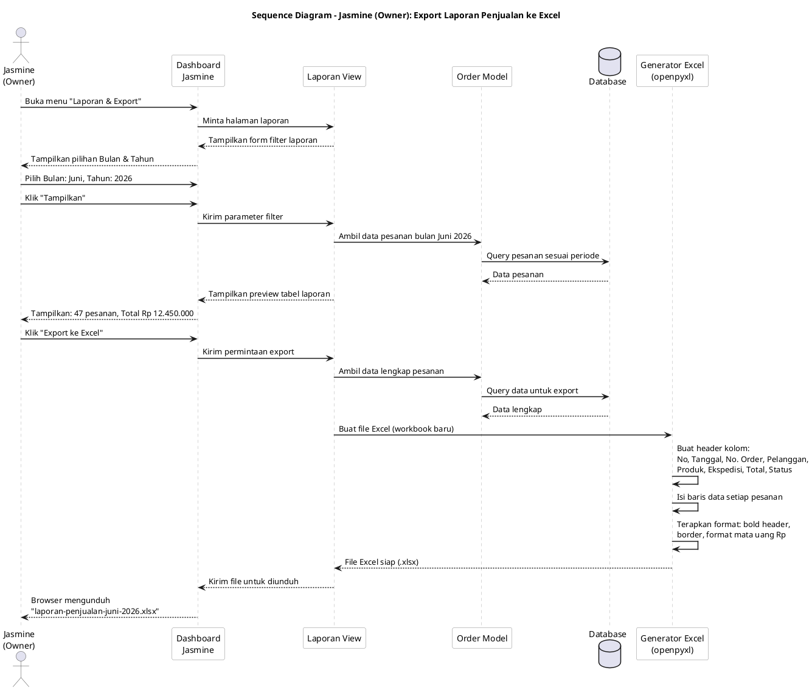
```plantuml
@startuml Jasmine_Export_Laporan
title Sequence Diagram - Jasmine (Owner): Export Laporan Penjualan ke Excel

skinparam sequenceArrowThickness 1.5
skinparam roundcorner 5
skinparam sequenceParticipantBackgroundColor #FFFFFF
skinparam sequenceParticipantBorderColor #888888
skinparam sequenceLifeLineBorderColor #AAAAAA
skinparam actorBorderColor #444444

actor "Jasmine\n(Owner)" as J
participant "Dashboard\nJasmine" as D
participant "Laporan View" as V
participant "Order Model" as O
database "Database" as DB
participant "Generator Excel\n(openpyxl)" as X

J -> D : Buka menu "Laporan & Export"
D -> V : Minta halaman laporan
V --> D : Tampilkan form filter laporan
D --> J : Tampilkan pilihan Bulan & Tahun

J -> D : Pilih Bulan: Juni, Tahun: 2026
J -> D : Klik "Tampilkan"
D -> V : Kirim parameter filter
V -> O : Ambil data pesanan bulan Juni 2026
O -> DB : Query pesanan sesuai periode
DB --> O : Data pesanan
V --> D : Tampilkan preview tabel laporan
D --> J : Tampilkan: 47 pesanan, Total Rp 12.450.000

J -> D : Klik "Export ke Excel"
D -> V : Kirim permintaan export
V -> O : Ambil data lengkap pesanan
O -> DB : Query data untuk export
DB --> O : Data lengkap
V -> X : Buat file Excel (workbook baru)
X -> X : Buat header kolom:\nNo, Tanggal, No. Order, Pelanggan,\nProduk, Ekspedisi, Total, Status
X -> X : Isi baris data setiap pesanan
X -> X : Terapkan format: bold header,\nborder, format mata uang Rp
X --> V : File Excel siap (.xlsx)
V --> D : Kirim file untuk diunduh
D --> J : Browser mengunduh\n"laporan-penjualan-juni-2026.xlsx"

@enduml
```

---

## 20. Jasmine — Kelola Akun Admin Toko

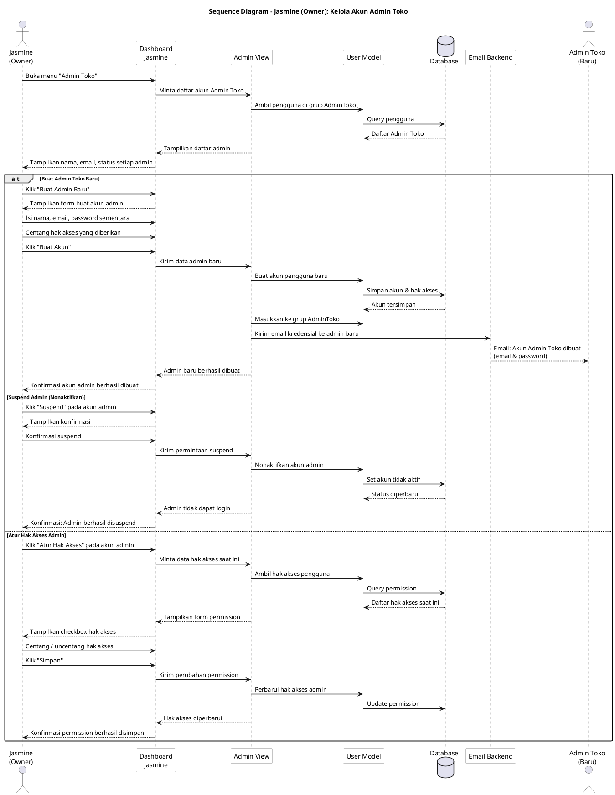
```plantuml
@startuml Jasmine_Kelola_Admin
title Sequence Diagram - Jasmine (Owner): Kelola Akun Admin Toko

skinparam sequenceArrowThickness 1.5
skinparam roundcorner 5
skinparam sequenceParticipantBackgroundColor #FFFFFF
skinparam sequenceParticipantBorderColor #888888
skinparam sequenceLifeLineBorderColor #AAAAAA
skinparam actorBorderColor #444444

actor "Jasmine\n(Owner)" as J
participant "Dashboard\nJasmine" as D
participant "Admin View" as V
participant "User Model" as M
database "Database" as DB
participant "Email Backend" as E
actor "Admin Toko\n(Baru)" as A

J -> D : Buka menu "Admin Toko"
D -> V : Minta daftar akun Admin Toko
V -> M : Ambil pengguna di grup AdminToko
M -> DB : Query pengguna
DB --> M : Daftar Admin Toko
V --> D : Tampilkan daftar admin
D --> J : Tampilkan nama, email, status setiap admin

alt Buat Admin Toko Baru
    J -> D : Klik "Buat Admin Baru"
    D --> J : Tampilkan form buat akun admin
    J -> D : Isi nama, email, password sementara
    J -> D : Centang hak akses yang diberikan
    J -> D : Klik "Buat Akun"
    D -> V : Kirim data admin baru
    V -> M : Buat akun pengguna baru
    M -> DB : Simpan akun & hak akses
    DB --> M : Akun tersimpan
    V -> M : Masukkan ke grup AdminToko
    V -> E : Kirim email kredensial ke admin baru
    E --> A : Email: Akun Admin Toko dibuat\n(email & password)
    V --> D : Admin baru berhasil dibuat
    D --> J : Konfirmasi akun admin berhasil dibuat

else Suspend Admin (Nonaktifkan)
    J -> D : Klik "Suspend" pada akun admin
    D --> J : Tampilkan konfirmasi
    J -> D : Konfirmasi suspend
    D -> V : Kirim permintaan suspend
    V -> M : Nonaktifkan akun admin
    M -> DB : Set akun tidak aktif
    DB --> M : Status diperbarui
    V --> D : Admin tidak dapat login
    D --> J : Konfirmasi: Admin berhasil disuspend

else Atur Hak Akses Admin
    J -> D : Klik "Atur Hak Akses" pada akun admin
    D -> V : Minta data hak akses saat ini
    V -> M : Ambil hak akses pengguna
    M -> DB : Query permission
    DB --> M : Daftar hak akses saat ini
    V --> D : Tampilkan form permission
    D --> J : Tampilkan checkbox hak akses
    J -> D : Centang / uncentang hak akses
    J -> D : Klik "Simpan"
    D -> V : Kirim perubahan permission
    V -> M : Perbarui hak akses admin
    M -> DB : Update permission
    V --> D : Hak akses diperbarui
    D --> J : Konfirmasi permission berhasil disimpan
end

@enduml
```

---

## Ringkasan Partisipan per Diagram

| No | Proses | Aktor | Partisipan Sistem |
|---|---|---|---|
| 1 | Registrasi Akun | Pengguna | Form Registrasi, Auth View, User Model, Database |
| 2 | Login Akun | Pengguna | Form Login, Auth View, User Model, Database |
| 3 | Google OAuth | Pengguna | Auth View (Allauth), Google OAuth, User Model, Database |
| 4 | Lupa Password | Pengguna | Form, Auth View, User Model, Database, Email |
| 5 | Katalog & Filter | Pengguna | Halaman Katalog, Katalog View, Produk Model, Database |
| 6 | Detail Produk | Pengguna | Halaman Detail, Produk View, Produk Model, Ulasan Model, DB |
| 7 | Tambah Keranjang | Pengguna | Halaman Produk, Keranjang View, Keranjang Model, Database |
| 8 | Wishlist | Customer | Halaman Produk, Wishlist View, Wishlist Model, Database |
| 9 | Checkout & Pembayaran | Customer | Halaman Checkout, Checkout View, RajaOngkir, Order Model, Midtrans, Email |
| 10 | Tracking Pesanan | Customer | Halaman Pesanan, Order View, Order Model, Database |
| 11 | Konfirmasi Penerimaan | Customer | Halaman Detail, Order View, Order Model, Database, Email, APScheduler |
| 12 | Tulis Ulasan | Customer | Form Ulasan, Ulasan View, Ulasan Model, Produk Model, Database |
| 13 | Laporan Garansi | Customer, Admin | Form Laporan, Garansi View, Garansi Model, Database, Email |
| 14 | Admin Kelola Produk | Admin Toko | Panel Admin, Produk View, Produk Model, Database |
| 15 | Admin Proses Pesanan | Admin Toko, Customer | Panel Admin, Order View, Order Model, Database, Email |
| 16 | Admin Moderasi Ulasan | Admin Toko | Panel Admin, Ulasan View, Ulasan Model, Produk Model, Database |
| 17 | Admin Tinjau Garansi | Admin Toko, Customer | Panel Admin, Garansi View, Garansi Model, Database, Email |
| 18 | Jasmine Kelola Produk | Jasmine | Dashboard Jasmine, Produk View, Produk Model, Database |
| 19 | Jasmine Export Laporan | Jasmine | Dashboard Jasmine, Laporan View, Order Model, Database, openpyxl |
| 20 | Jasmine Kelola Admin | Jasmine, Admin Baru | Dashboard Jasmine, Admin View, User Model, Database, Email |
